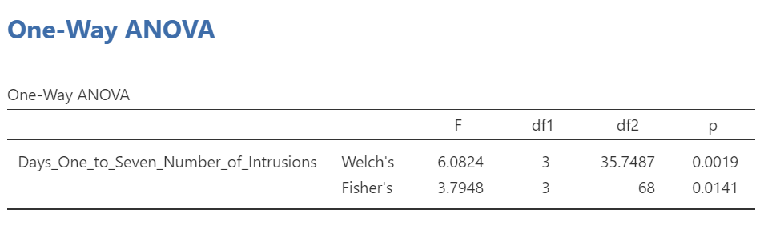
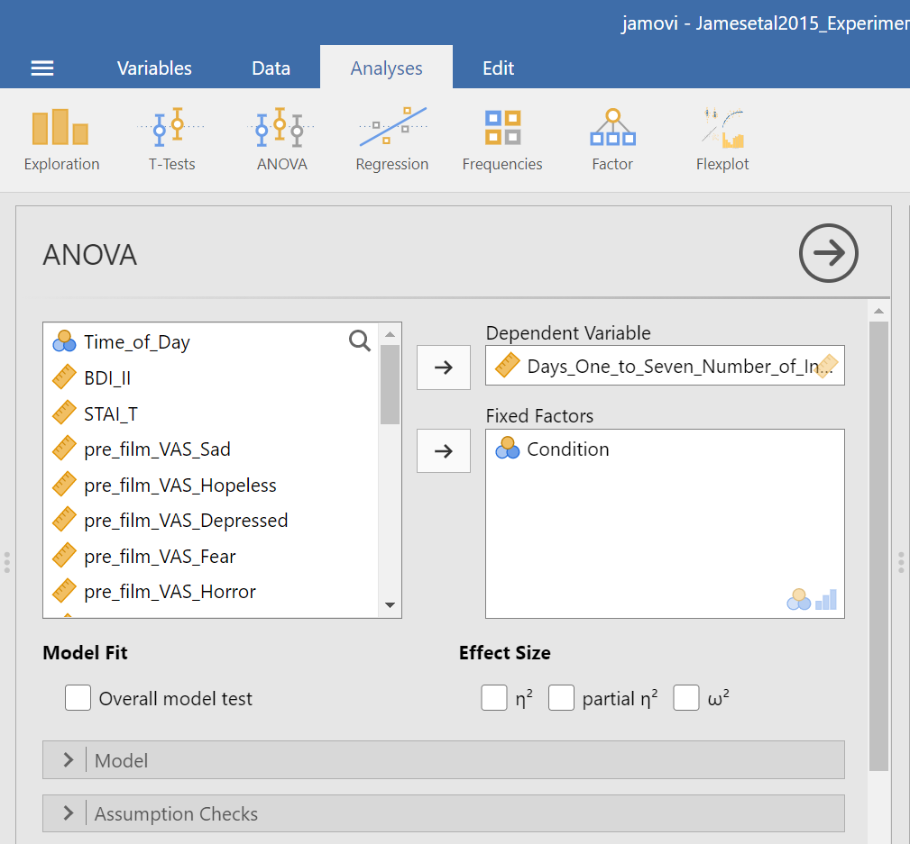
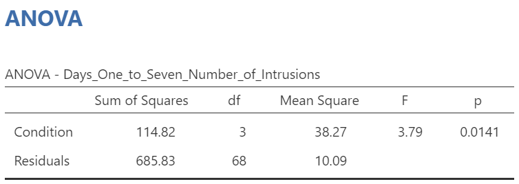

---
output:
  html_document: default
  pdf_document: default
  word_document: default
---
# One-way ANOVA

<script>
$("#coverpic").hide();
</script>

<span class="newthought">
The analysis of variance is not a mathematical theorem, but rather a convenient method of arranging the arithmetic.
---R. A. Fisher
</span>


<div class="marginnote">
This lab is modified and extended from [Open Stats Labs](https://sites.trinity.edu/osl). Thanks to Open Stats Labs (Dr. Kevin P. McIntyre) for their fantastic work.
</div>

## How to not think about bad memories by playing Tetris

This lab activity uses the open data from Experiment 2 of James et al. (2015) to teach one-way ANOVA with planned comparisons. Results of the activity provided below should exactly reproduce the results described in the paper.

### Study description

Following traumatic experiences, some people have flashbacks, which are also called "intrusive memories" and are characterized by involuntary images of aspects of the traumatic event. Although people often try to simply forget traumatic memories, this approach is not very effective. Instead, previous research suggests that a better approach may be to try to change aspects of the memory after it is formed. For example, some research shows that traumatic memories can be altered and weakened to the point that they are no longer intrusive.

Because intrusive memories of trauma are often visual in nature, James and colleagues (2015) sought to explore whether completing a visuospatial task (e.g., Tetris) after a memory was formed would interfere with the storage of that memory, and thereby reduce the frequency of subsequent intrusions. They hypothesized that  only participants who complete a visuo-spatial task after reactivation of the traumatic memories would experience a  reduction in intrusive memories. In comparison, simply completing a visuo-spatial task (without reactivation) or reactivation (without a visuo-spatial task), would not reduce the occurrence intrusive memories.

In other words, if you play Tetris shortly after you were remembering bad memories, playing Tetris might weaken those memories, which could cause you experience those kinds of intrusive memories less often in the future.

### Study Methods

To test their hypothesis, the  authors conducted an experiment (N = 72,  n = 18 per condition). The procedure is summarized as follows:

**Trauma Film**: All participants viewed a series of video clips of graphic violence (e.g., a person getting hit by a van while using his phone as he crosses the road) as a way to create memories that should become intrusive memories. Participants then went home and recorded the number of intrusive memories they experienced over the next 24 hours. Because this is before the experimental manipulations, all groups were predicted to have an  equal occurrence of intrusive memories during the first 24-hours (called Day 0).

**Experimental Task**: After this 24-hour period, the participants returned to the lab and completed the experimental task. The experimenters randomly assigned participants to ONE of the following conditions:

1. No-task control: These participants completed a 10-minute music filler task.
2. Reactivation + Tetris: These participants were shown a series of images from the trauma film to reactivate the traumatic memories (i.e., reactivation task). After a 10-minute music filler task, participants played the video game Tetris for 12 minutes.
3. Tetris Only: These participants played Tetris for 12 minutes, but did not complete the reactivation task.
4. Reactivation Only: These participants completed the reactivation task, but did not play Tetris.

**Intrusive Memories**: All participants were asked to record the number of intrusive memories that they experienced over the next seven days (Days 1 to 7).

After the seven days had passed, participants completed an Intrusion-Provocation Task, in which they were shown blurred images from the trauma film and asked to indicate whether the blurred image triggered an intrusive memory.


## Important Stuff
- citation: James, E. L., Bonsall, M. B., Hoppitt, L., Tunbridge, E. M., Geddes, J. R., Milton, A. L., & Holmes, E. A. (2015). Computer game play reduces intrusive memories of experimental trauma via re-consolidation-update mechanisms. Psychological Science, 26, 1201-1215.
- [Link to .pdf of article](http://journals.sagepub.com/stoken/default+domain/hQ2W4fbPrZVJ7eyNJaqu/full)

## JAMOVI

<div class="marginnote">
This section is copied almost verbatim, with some editorial changes, from [Answering questions with data: The lab manual for R, Excel, SPSS and JAMOVI, Lab 7, Section 7.6, SPSS](https://www.erinmazerolle.com/statisticsLab/lab-7-one-way-anova.html#spss-7), according to its [CC license](https://creativecommons.org/licenses/by-sa/4.0/deed.ast). Thank you to Crump, Krishnan, Volz, &   Chavarga (2018). 
</div>

In this lab (and the next lab), we will use JAMOVI to:

1. Perform a One-Factor Analysis of Variance (ANOVA) and graph the data
2. Planned comparisons: Use programmed contrasts to locate differences 
3. Unplanned comparisons: Use a *post-hoc* test to locate differences

### Checking Assumptions

Recall that the ANOVA is a parametric test, and the ANOVA test assumes: 

1. The sampling distributions are normally distributed. Consider the central limit theorem. 
2. The data are measured using an interval or a ratio scale. Consider what you know about how the data were collected and/or look at the variable attributes in the JAMOVI data spreadsheet.
3. The scores are independent. Consider the experimental design and/or look at the JAMOVI data spreadsheet to verify whether or not different participants or subjects contribute to the means.
4. The variances in the populations are roughly equal. Consider the result of Levene’s test.

### Performing a One-Factor Analysis of Variance (ANOVA) & Graphing the data

First, let's open the relevant data file in JAMOVI. You can find the file on Moodle. Your data should look like this:

```{r , echo=FALSE,dev='png'}
knitr::include_graphics('img/DataFileLooksLikeThis.png')
```

In this experiment, there was one important independent variable, called `Condition`, and it has four levels. In the variable attribute’s information, we see the levels are 1, 2, 3, and 4. These will correspond to the four levels in shown below (and these labels are shown in the data spreadsheet):

1. No-Task Control
2. Reactivation + Tetris
3. Tetris Only
4. Reactivation Only

The dependent variable is recorded in the column `Days_One_to_Seven_Number_of_Intrusions`. This represents the mean number of intrusions for that week. We are testing the hypothesis that the number of intrusive memories will be different among the groups (1-4). For now, we will not specify which group we think is going to have the highest or lowest number of memories, but rather we will test if there is a difference SOMEWHERE between these 4 groups.

Let's begin. Go to <span style="color:blue">Analyses</span>, then <span style="color:blue">ANOVA</span>, then select <span style="color:blue">One-Way ANOVA...</span>

```{r , echo=FALSE,dev='png'}

```

Look at the the One-Way ANOVA commands panel on the left. Here, you will specify the dependent variable (by moving the variable `Days_One_to_Seven_Number_of_Intrusions` from the list of variables on the left to the field to the right labeled “Dependent Variables”) and the factor, which is the same thing as the independent variable or grouping variable as you may remember from your experience with the *t*-tests (by moving the variable `Condition` from the variable list into the field labeled "Grouping Variable” on the right). Your window should look like this:

```{r , echo=FALSE,dev='png'}
knitr::include_graphics('img/OneWayANOVACommandsWithVariablesSelected.png')
```

Now, consider the default setting for other commands and whether we might need more information. Under **Additional Statistics**, we could click the <span style="color:blue">Descriptives table</span> and <span style="color:blue"> Descriptives plots</span>.

```{r , echo=FALSE,dev='png'}
knitr::include_graphics('img/OneWayANOVACommandsWithDescriptiveStatsSelected.png')
```

In the Results panel, JAMOVI will produce some output depicting the descriptive statistics and an associated graph. 

```{r , echo=FALSE,dev='png'}
knitr::include_graphics('img/OneWayANOVAResultsDescriptiveTable.png')
```

```{r , echo=FALSE,dev='png'}
knitr::include_graphics('img/OneWayANOVAResultsDescriptivePlot.png')
```

Although the titles of the conditions on the x-axis are not easy to read, the graph can be helpful. Remember that we looked at the four conditions (1 = No-Task Control, 2 = Reactivation+Tetris, 3 = Tetris Only, and 4 = Reactivation Only).

Then, under **Variances**, we could click <span style="color:blue">Assume equal (Fisher’s)</span> just in case we believe the assumption of homogeneity of variance is upheld. With that assumption in mind, under **Assumption Checks**, we should also select <span style="color:blue">Homogeneity test</span>. You might also request <span style="color:blue">Normality test (Fisher’s)</span>; however, you might not make this selection if you already checked the data set to see if it met this assumption.

```{r , echo=FALSE,dev='png'}

```

In the Results panel, JAMOVI will produce some output depicting the results of the ANOVA (an ANOVA table) and the results of the assumption checking tests. The Assumption Checks will appear after the Descriptives Table, but before the Plots. That output should look something like this:

```{r , echo=FALSE,dev='png'}

```

Levene’s test is significant (*p* <.05) suggesting that there is a violation of the assumption of homogeneity of variance. In other words, we cannot assume equal variances. Remember that this interpretation of Levene’s test only tells us how to proceed when interpreting the results of the ANOVA. It tells us if we should report the ANOVA using Welch’s adjustment (unequal variances among groups; heterogeneity of variance) or if we could report Fisher’s statistic (equal variances among groups; homogeneity of variance).

Above the the Assumption Checks and the Group Descriptives table are the results of the One-Way ANOVA. Let’s look at this table. 

```{r , echo=FALSE,dev='png'}

```

Because Levene’s test is significant, we should report the ANOVA with Welch’s adjustment.

```{r , echo=FALSE,dev='png'}

```

We see our *F*-statistic listed is 6.0824, with a *p*-value of .0019. This tests the null hypothesis that there is no difference among the groups. Since *p* is less than our likely alpha level (.05), we can reject the null hypothesis and conclude that there IS a difference somewhere among these groups. We may write this result in APA format as follows:

An ANOVA demonstrated that the effect of condition on mean intrusive memories over days 1-7 was significant, *F*(3, 35.75) = 6.08, *p* < .05. 

Had Levene’s test been non-significant, we might have reported Fisher’s statistic. 

```{r , echo=FALSE,dev='png'}
knitr::include_graphics('img/OneWayANOVAResultsANOVATableReadingFishers.png')
```

In that row of the One-Way ANOVA results table, we see our *F*-statistic listed is 3.7948, with a *p*-value of .014. Since *p* is less than our likely alpha level (.05), we would have rejected the null hypothesis and concluded that there IS a difference somewhere among these groups. We may write this result in APA format as follows:

An ANOVA demonstrated that the effect of condition on mean intrusive memories over days 1-7 was significant, *F*(3, 68) = 3.79, *p* < .05. 

To examine the data further, let's refer to the graph created by JAMOVI: 

```{r , echo=FALSE,dev='png'}
knitr::include_graphics('img/OneWayANOVAResultsDescriptivePlot.png')
```

Remember 1 = No-Task Control, 2 = Reactivation+Tetris, 3 = Tetris Only, and 4 = Reactivation Only.

Alternatively, you could request an appropriate graph for these means in JAMOVI. Recall that a line graph would be useful if the variable represented on the *x*-axis (the independent variable) was measured using a quasi-interval, an interval or a ratio scale; a bar graph would be appropriate if that variable was measured using a nominal or ordinal scale. 

Also, recall that when you looked at descriptive statistics for your data set, you can easily add options to view **Plots**. Plots can be considered synonymous with graphs. To get these plots, click <span style="color:blue">Analyses</span>, <span style="color:blue">Exploration</span>, and <span style="color:blue">Descriptives</span>. Move the dependent variable to the “Variables” field and the independent variable to the “Split by” field. Under the **Plots** ribbon, select the appropriate graph. For the current example, select <span style="color:blue">Bar plot</span>.

```{r , echo=FALSE,dev='png'}
knitr::include_graphics('img/BarGraphCommands.png')
```

The resulting graph is much easier to read.

```{r , echo=FALSE,dev='png'}
knitr::include_graphics('img/ResultingBarGraph.png')
```

We can see that the Reactivation + Tetris condition appears to have the smallest mean. As for the others, they are all greater than Reactivation + Tetris, but differ somewhat from each other as well. It is important to know that at this point, we do not know where the significant differences could be. For example, it could be that Reactivation + Tetris is different from only No-Task Control, or it could be that it is different from other groups as well. In order to locate where the differences are, we must conduct additional analyses called either planned or unplanned comparisons (in the next lab).

#### Some APA formatting reminders for writing results sections

1. Always note the name of the test you performed (in this case, one-way analysis of variance, or ANOVA) and whether the result is significant or non-significant *(**Note**: We do not use the word insignificant.)*. 

2. We usually round to two decimal places, except for *p*-values. If your *p*-value was .0001, it would be okay to write *p* = .0001 or *p* < .001.

3. Do not include a leading 0 before the decimal for the *p*-value (*p* = .001 not *p* = 0.001, or *p* < .05 not *p* < 0.05).

<div class="marginnote">
Yes, I'm serious. No, I don't know why. Yes, it does seem a bit silly. Yes, you lose points if you don't adhere to APA format when requested to do so.
</div>
4. Pay attention to spaces, parentheses, etc. APA is very picky about that. For example, it's *F*(3, 35.75) = 6.08 **not** *F*(3,35.75)=6.08. There are spaces on either side of =, >, or < symbols.

5. Italicize symbols such as *M*, *SD*, *p*, *t*, *d*, and *F*.

#### Other Commands Used to Conduct the One-Way ANOVA in JAMOVI: ANOVA

Oftentimes, there is more than one way to accomplish a similar task using JAMOVI. We have examined how to conduct an ANOVA using the <span style="color:blue">Analyses</span> → <span style="color:blue">ANOVA</span> → <span style="color:blue">One-Way ANOVA</span> commands. Using the same example, let’s look at another set of commands to request an ANOVA.

Click on <span style="color:blue">Analyses</span>, <span style="color:blue"> ANOVA</span>, and then <span style="color:blue">ANOVA</span>.

```{r , echo=FALSE,dev='png'}
knitr::include_graphics('img/ANOVACommands.png')
```

Place the dependent variable (`Days_One_to_Seven_Number_of_Intrusions`) in its appropriate field – in the “Dependent List” field. Then, place `Condition` into the "Fixed Factor(s)" field.

```{r , echo=FALSE,dev='png'}

```

Under the “Assumption Checks” ribbon, you could request <span style="color:blue"> Homogeneity test</span>. You could also request <span style="color:blue"> Normality test</span>; however, if you have previously checked the data to see if it met the assumption of normality, you would not need to do so here again. 

```{r , echo=FALSE,dev='png'}
knitr::include_graphics('img/ANOVACommandsWithAssumptionChecksAndVariance.png')
```

JAMOVI should generate three output tables in the output file. Let’s focus on the homogeneity test first. As we noticed when using the other set of commands, you should see that Levene’s test is significant.

```{r , echo=FALSE,dev='png'}
knitr::include_graphics('img/ANOVAResultsAssumptionChecks.png')
```

Based on that significant result, we would prefer to use an ANOVA with Welch's adjustment (robust ANOVA). Recall that adjustment can be requested using the other set of commands (<span style="color:blue">Analyses</span> → <span style="color:blue">ANOVA</span> → <span style="color:blue">One-Way ANOVA</span>), and by default, the adjustment we might use was selected (Welch's). The selection reads as <span style="color:blue">Don’t assume equal (Welch’s)</span>. This robust ANOVA is not available to using the current menu options (<span style="color:blue">Analyses</span> → <span style="color:blue">ANOVA</span> → <span style="color:blue">ANOVA</span>). That is a drawback to this set of commands. This is to say that this set of commands is only useful when homogeneity of variances can be assumed.

Although we did not get to request the test both with and without the adjustment using this second set of commands (<span style="color:blue">Analyses</span> → <span style="color:blue">ANOVA</span> → <span style="color:blue"> ANOVA</span>), we can compare and contrast the regular overall ANOVA tests. While the table generated using these commands is slightly different from the ANOVA table generated using the other commands, you should notice the degrees of freedom, the *F*-statistic, and the *p*-value are the same in this table as they were for the row reporting Fisher’s statistic in the table generated with the other set of commands.

In the Results pane, you should see this ANOVA table:

```{r , echo=FALSE,dev='png'}

```

Let's compare the values found in it to the values found in the table we generated with the other set of commands.

```{r , echo=FALSE,dev='png'}
knitr::include_graphics('img/ANOVAResultsANOVATable_StatsHighlighted.png')
```

```{r , echo=FALSE,dev='png'}

```
Both tables report the same statistics.

### Homework

See [Moodle](https://moodle.stfx.ca/).