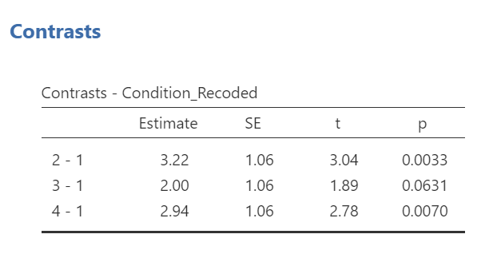

---
output:
  pdf_document: default
  html_document: default
  word_document: default
---
# Followup Tests

<script>
$("#coverpic").hide();
</script>

<div class="marginnote">
This lab is modified and extended from [Open Stats Labs](https://sites.trinity.edu/osl). Thanks to Open Stats Labs (Dr. Kevin P. McIntyre) for their fantastic work.
</div>

## But which pairs of conditions were different?!?!

In this lab, we will continue our analysis of the James et al. (2015) dataset described in Lab #1.

## Important Stuff
- citation: James, E. L., Bonsall, M. B., Hoppitt, L., Tunbridge, E. M., Geddes, J. R., Milton, A. L., & Holmes, E. A. (2015). Computer game play reduces intrusive memories of experimental trauma via re-consolidation-update mechanisms. Psychological Science, 26, 1201-1215.
- [Link to .pdf of article](pdfs/James2015.pdf)


## Rationale of Follow-Up Tests

In practice, you know before conducting your experiment and analyses whether you have reason to look for specific differences (based on what the literature says, theories that exist, etc.) or you will explore the differences without reason to look at something specific (if you have a significant result in the omnibus ANOVA).  This differentiation will determine whether you will conduct orthogonal linear contrasts / planned comparisons (you had reasons to look for specific differences / *a priori* comparisons) or you will run a *post-hoc* test to explore the differences (you had no reason to look for any specific differences).  

In lab, we are going to take both approaches with the same example just to discuss how to do each type of follow-up. You will **NOT** run conduct both planned comparisons and *post-hoc* tests in practice – EVER.  We are doing this for demonstration purposes only.

## Conducting the Analyses

### Unplanned Comparisons: Method 1

One way to find the differences between groups in a one-way, or one-factor, ANOVA is to conduct something called a *post-hoc* test. This test is also referred to as "unplanned" because you don't have to plan it before you run your ANOVA. However, you can only conduct unplanned tests when you have a significant overall ANOVA. The *post-hoc test* is neat because it is conveniently summoned during the process of conducting an ANOVA, and its results are presented in a compact table. 

Let's use a *post-hoc* test to look at this data. Although there are many types of *post-hoc* tests, a commonly used one is Tukey *post-hoc* test when the assumption of homogeneity of variance is met. When that assumption is violated, Games-Howell is commonly used. Let's begin.

We are going to go through similar steps as discussed in order to conduct our ANOVA: Go to <span style="color:blue">Analyses</span>, then <span style="color:blue">ANOVA</span>, then <span style="color:blue">One-Way ANOVA...</span>

Place the dependent variable (`Days_One_to_Seven_Number_of_Intrusions`) in its appropriate field – in the “Dependent Variables” field. Then, place `Condition` into the "Grouping Variable" field. 

```{r , echo=FALSE,dev='png'}
knitr::include_graphics('img/OneWayANOVACommands_BeforeFollowUps.png')
```

Next, click the ribbon labeled <span style="color:blue">Post-Hoc Tests</span>. Below the ribbon, options for various *post-hoc* tests are available. We are going to choose <span style="color:blue">Games-Howell</span> (**Question: Why are we selecting Games-Howell?**):

```{r , echo=FALSE,dev='png'}
knitr::include_graphics('img/OneWayANOVAPostHocCommands.png')
```

In the Results pane, JAMOVI will produce the ANOVA table, and tables for descriptive statistics and assumption checks if you requested them, followed by a table that refers to the *post-hoc* test. Let's look at the table:


```{r , echo=FALSE,dev='png'}

```

Notice that the table avoids redundancy; it considers the comparison between No-task Control and Reactivation + Tetris to be same as that between Reactivation + Tetris and No-task Control. In essence, we only need to look at half of the table. To simplify what we need to read, the JAMOVI output shows only the top right triangle (and excludes the bottom left triangle). 

If you start reading along row 1, we see this row compares No-task Control with Reactivation + Tetris. We see the corresponding *p*-value for this row is .031. Because this is less than our likely alpha level (.05), this means that these two conditions ARE significantly different from one another. 

```{r , echo=FALSE,dev='png'}
knitr::include_graphics('img/GamesHowellPostHocTest_SigPValue.png')
```

Look through the table: Are there other *p*-values that are less than alpha (.05)?

Reactivation + Tetris compared with Reactivation Only has a *p*-value of .013. This is also a significant difference. These are the only significant differences we see here. This means that, among the 4 groups, only two differences were found: Reactivation + Tetris is different from No-task Control, and Reactivation + Tetris is different from Reactivation Only.

```{r , echo=FALSE,dev='png'}
knitr::include_graphics('img/GamesHowellPostHocTest_2SigPValues.png')
```

```{r , echo=FALSE,dev='png'}
knitr::include_graphics('img/GamesHowellPostHocTest_SigAndNonSigPValues.png')
```

Notice that those *p*-values in yellow boxes are significant while those in black boxes are not significant. (Note: We could have asked JAMOVI to flag the significant *p*-values.)

There is no option to request the effect sizes of these differences here; however, you could calculate them.

#### Writing the Results 

An ANOVA using the Welch adjustment revealed a significant effect of condition on number of image-based intrusive memories recorded in the diary after intervention, *F*(3, 35.75) = 6.08, *p* = .002. A *post-hoc* Games-Howell test indicated that the mean number of memories for the Reactivation + Tetris group was significantly different from the mean of two other groups: No-Task Control, *p* = .031, and Reactivation Only, *p* = .013. The mean number of memories for the Reactivation + Tetris group was not significantly different from the mean of the Tetris Only group, *p* > .05. Specifically, the Reactivation + Tetris group reported fewer memories (*M* = 1.89, *SD* = 1.75) than the No-Task Control group (*M* = 5.11, *SD* = 4.23) and the Reactivation Only group (*M* = 4.83, *SD* = 3.33), but not significantly fewer memories than the Tetris Only group (*M* = 3.89, *SD* = 2.89). No significant differences were found between any other groups, *p* > .05.


### Unplanned Comparisons: Method 2

Within JAMOVI, there are different ways to run *post-hoc* tests, with different options depending on which you choose. To access the other method, you click <span style="color:blue">Analyses</span>, then <span style="color:blue">ANOVA</span>, and then <span style="color:blue">ANOVA</span> commands. Place the dependent variable (`Days_One_to_Seven_Number_of_Intrusions`) in its appropriate field – in the “Dependent Variables” field. Then, place `Condition` into the "Fixed Factor(s)" field. Alternatively, highlight the results generated in the Results pane. 
This time, click the <span style="color:blue">Post Hoc</span> ribbon. Move the `Condition` variable from the left field to the right field by highlighting the variable and clicking the right-facing arrow. 

```{r , echo=FALSE,dev='png'}
knitr::include_graphics('img/ANOVAPostHocCommands.png')
```

```{r , echo=FALSE,dev='png'}
knitr::include_graphics('img/ANOVAPostHocCommands2.png')
```

You should notice that by default, Tukey’s correction is selected. You might also notice that there is no option to request Games-Howell. Since we noticed a violation to the assumption of homogeneity of variance and have seen the results of Games-Howell in a previous section, we would have liked to have had that option.


```{r , echo=FALSE,dev='png'}
knitr::include_graphics('img/ANOVAPostHocCommands3.png')
```

You do not need to rerun the commands; you can just look at the results shown for this hypothetical situation:
While we cannot view request Games-Howell with this set of commands (<span style="color:blue">Analyses</span> → <span style="color:blue">ANOVA</span> → <span style="color:blue"> ANOVA</span>), you can see that had we been looking for Tukey’s correction with the other set of commands (<span style="color:blue">Analyses</span> → <span style="color:blue">ANOVA</span> → <span style="color:blue"> One-Way ANOVA</span> and requesting Tukey’s), we would have generated the same results in that case as we did using this set of commands.

```{r , echo=FALSE,dev='png'}
knitr::include_graphics('img/OneWayANOVAPostHocCommands_Tukeys.png')
```


Although the lack of the Games-Howell adjustment is a drawback to this set of commands, an advantage to this set of commands is that you could request the effect sizes here. To request that JAMOVI generate them, click on <span style="color:blue">Effect size</span>.
```{r , echo=FALSE,dev='png'}
knitr::include_graphics('img/ANOVAPostHocAndEffectSize.png')
```

Remember: It is a good idea to check whether the data set meets the assumption of homogeneity of variance before deciding which menu provides the best options for you.


### Planned Comparisons

For the sake of our demonstration, let’s follow the planned comparisons that the researchers reported. It is very likely their planned comparisons were based on the literature about visual images and memory. They report three planned comparisons:

1) No-Task Control vs. Reactivation + Tetris

2) Reactivation + Tetris vs. Tetris Only

3) Reactivation + Tetris vs. Reactivation Only

We did not discuss how to access planned comparisons in the first set of menu options in JAMOVI (<span style="color:blue">Analyses</span> → <span style="color:blue">ANOVA</span> → <span style="color:blue">One-Way ANOVA</span>) because it would require us to transform the grouping variable or independent variable for each and every comparison and then to use a different type of analysis. This is tedious work.

You can more easily request *a priori* follow-up tests using the <span style="color:blue">Analyses</span> → <span style="color:blue">ANOVA</span> → <span style="color:blue">ANOVA</span> commands. After having selected the previously noted commands, click on the “Contrasts” ribbon and click the black arrow next to the word "none" in the field to the right. You should see a menu appear giving you options for programmed contrasts.

```{r , echo=FALSE,dev='png'}

```

Please visit [Learning Statistics with Jamovi]( https://davidfoxcroft.github.io/lsj-book/) for more information on the types of contrasts that are programmed into JAMOVI. For a quick reference, let’s refer to Table 14.15 from Navarro and Foxcroft (2019). 

<div class="marginnote">
This following table is copied from [Learning statistics with jamovi: A tutorial for psychology students and other beginners, Version 0.70](https://www.learnstatswithjamovi.com/), according to its [CC license](https://creativecommons.org/licenses/by-sa/4.0/deed.ast). Thank you to Navarro & Foxcroft (2019). </div>

```{r , echo=FALSE,dev='png'}
knitr::include_graphics('img/ContrastTypesTableFromLSJ.png')
```

The best contrast option for our example is Simple; however, our groups are not in the order that allows this comparison. We want to compare Group 1 (No-Task Control) to Group 2 (Reactivation + Tetris), Group 2 (Reactivation + Tetris) to Group 3 (Tetris Only), and Group 2 (Reactivation + Tetris) to Group 4 (Reactivation Only). One way to accomplish a change in order so that we could use Simple is to move the Reactivation + Tetris group to first position in the order. 

Just in case you have not yet encountered recoding or need a refresher, let’s discuss one way it is accomplished in JAMOVI. First, click <span style="color:blue">Data</span>, and then, while the variable to be change is highlighted (which can be accomplished by clicking on the top of that column) click <span style="color:blue">Transform</span>. When the variable-attributes pane appears, rename the “new variable” to something that makes sense. We will use `Condition_Recoded` for our purposes. Also, under “using transform,” select <span style="color:blue">Create New Transform…</span>.

```{r , echo=FALSE,dev='png'}
knitr::include_graphics('img/RecodingConditionForPlannedContrasts.png')
```

When the pane regarding the transformation appears, indicate what should be changed. In our current example, we want to switch the first and second groups in terms of their position (We want Reactivation + Tetris to be in the first place and No-Task Control to be in the second place when the comparisons are made). Click <span style="color:blue">Add recode condition</span> to begin recoding.

```{r , echo=FALSE,dev='png'}
knitr::include_graphics('img/TransformationForPlannedContrasts.png')
```


```{r , echo=FALSE,dev='png'}

```

You may notice the term `$source` in this window. That term represents that this transformation you are creating could be used with other variables to be recoded later (so long as your intention in those subsequent transformations is to switch groups 1 and 2 and to keep all other groups in the original order). In the transformation we will create, our `$source` is `Condition`.

Click <span style="color:blue">Add recode condition</span> to add other conditions. We do not want any changes to Groups 3 (Tetris Only) or 4 (Reactivation Only).

```{r , echo=FALSE,dev='png'}
knitr::include_graphics('img/TransformationForPlannedContrasts3.png')
```

We can close out the transformation by clicking the downward-facing arrow and then the upward-facing arrow.

```{r , echo=FALSE,dev='png'}
knitr::include_graphics('img/ClosingTransformation.png')
```

```{r , echo=FALSE,dev='png'}
knitr::include_graphics('img/ClosingTransformation2.png')
```

In the data, you will see the newly created variable for recoding condition, `Condition_Recoded`.

```{r , echo=FALSE,dev='png'}

```

Now, we can return to the planned contrasts, and move the new variable over. Click <span style="color:blue">Analyses</span>, then <span style="color:blue">ANOVA</span>, and then <span style="color:blue">ANOVA</span> commands. Place the dependent variable (`Days_One_to_Seven_Number_of_Intrusions`) in its appropriate field – in the “Dependent Variable” field. Then, place `Condition_Recoded` (or whatever you named your new variable) into the "Fixed Factor(s)" field. 

```{r , echo=FALSE,dev='png'}
knitr::include_graphics('img/ANOVACommandsWithRecodedCondition.png')
```

Click on the “Contrasts” ribbon. Use the drop-down menu by the word "none" to select Simple.  

```{r , echo=FALSE,dev='png'}
knitr::include_graphics('img/ANOVACommandsWithRecodedCondition.png')
```


```{r , echo=FALSE,dev='png'}
knitr::include_graphics('img/ANOVACommandsWithPlannedContrast.png')
```

In the Results pane, JAMOVI will generate an ANOVA table similar to what we discussed previously plus a novel table called “Contrasts”.

```{r , echo=FALSE,dev='png'}

```

```{r , echo=FALSE,dev='png'}

```

It would be nice to see the names of those groups, rather than the numbers. If you like, try to add notes to your table to demonstrate what the numbers represent:

```{r , echo=FALSE,dev='png'}
knitr::include_graphics('img/AddingNotesToResultsTables.png')
```


```{r , echo=FALSE,dev='png'}
knitr::include_graphics('img/AddingNotesToResultsTables2.png')
```

While the convenience of a programmed contrast may be appealing, you should also notice a drawback of accessing the contrasts via the <span style="color:blue">Analyses</span> → <span style="color:blue">ANOVA</span> → <span style="color:blue">ANOVA</span> commands: not only are we unable to request both the regular and the robust ANOVA, but also we are unable to look at contrasts with corrections for the violation to the assumption of homogeneity of variance. As you may recall from class, it would be better to look at these follow-up tests with Hedge’s correction.

Remember: It is a good idea to check your data set before deciding whether a menu and set of commands is helpful in a given case. 

## Homework

See [Moodle](https://moodle.stfx.ca/).


