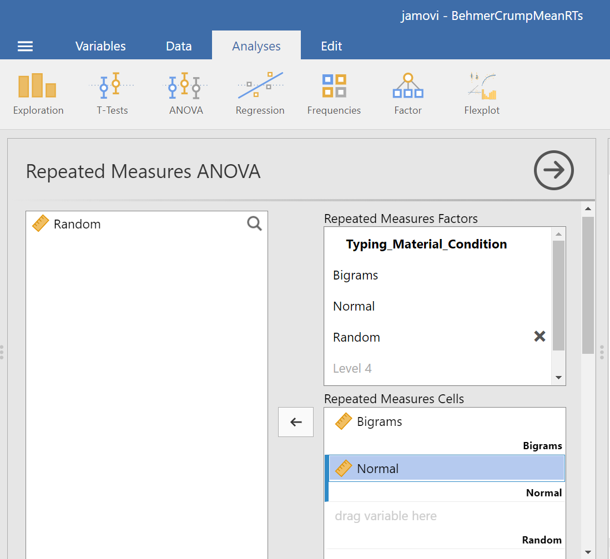
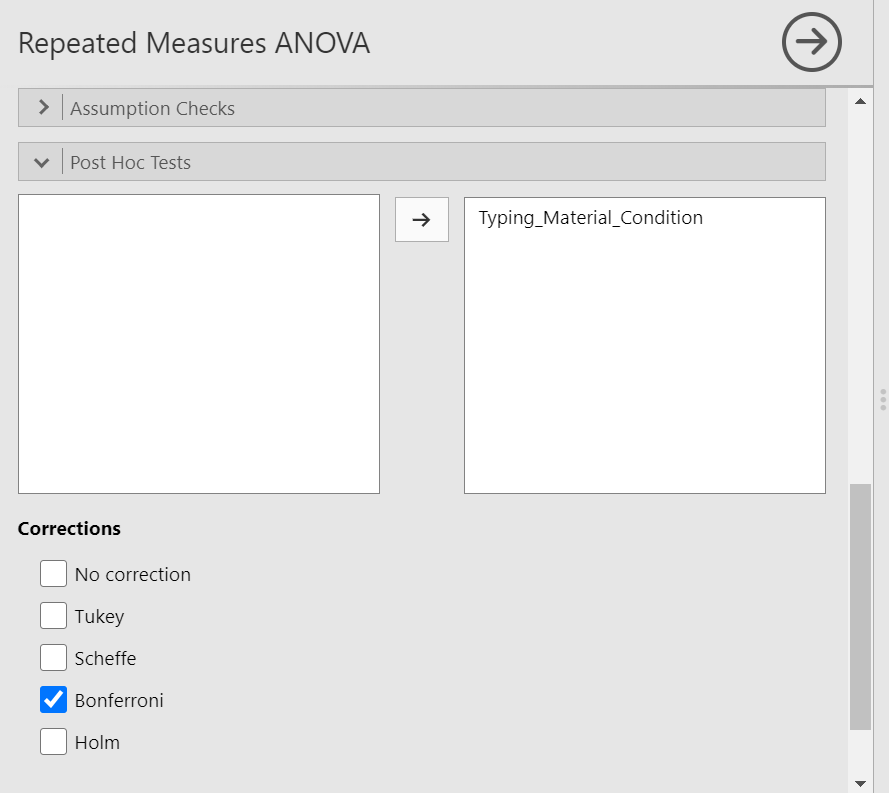

# Repeated Measures ANOVA

<script>
$("#coverpic").hide();
</script>

<span class="newthought">
However, perhaps the main point is that you are under no obligation to analyse variance into its parts if it does not come apart easily, and its unwillingness to do so naturally indicates that one’s line of approach is not very fruitful.
---R. A. Fisher
</span>

## Betcha can't type JHDBZKCO very fast on your first try

This lab activity uses the data from Behmer & Crump (2017) to teach one-factor repeated measures ANOVA with-up follow comparisons

### Study description

Behmer & Crump (2017) used the everyday task of typing on a computer keyboard to ask questions about how people learn to put sequences of actions together. Whenever you type a series of letters on the keyboard, you are putting a sequence of actions together, so typing is task that could be used to measure skilled sequencing. Typing also happens to be a convenient task for measuring sequencing. For example, every time a person types a letter, the timing of the button press and the letter pressed can be measured and stored for later analysis.

Behmer & Crump were interested in asking a few different questions, however, we will simplify everything and talk about replication. First we describe an interesting finding from previous research. Behmer & Crump repeated an experiment that should also produce this same finding. If they succeed in doing this, it means the finding can be replicated, and that it happens in more than one lab.

**Finding from previous research:** Prior research showed that typists do something funny. Skilled typists can type normal words very fast. This suggests they know how to locate all of the letters on the keyboard, and can press each letter very quickly to type words. That part isn't particularly funny. However, if you take really skilled typists and make them type random letters like this:  kwitb dhhgjtryq xkldpt mazhyffdt, guess what happens? They slow down a lot. It's kind of weird that a typist would slow down, after all they can type letters really fast when they appear in words, but not when they appear in random orders...what gives? Last, it turns out that typists are kind of in the middle in terms of speed, if you ask them to type non-words that have similar properties to words, such as: quenp hamlke phwempy.

To summarize, prior research showed that typing speed changes as a function of the structure of the text, roughly in this order from fastest to slowest.

(FASTEST)  Normal Words < Word-like Non-words < Random strings  (SLOWEST)

**Replication question:** Behmer & Crump also measured typists while they typed words, non-words that were English-like, and random strings. They had some additional things they were interested in, but for us, we are interested in whether they would show the same effect. Would they replicate the pattern: Normal words (Fastest) < Word-like Non-words (medium) < Random strings (Slowest)?


### Study Methods

The authors conducted a repeated measures experiment. A total of 38 subjects were used for the analysis.

**Independent Variable**: The IV Stimulus or typing material had three levels: Normal, Bigrams, and Random. Normal refers to normal 5 letter English words (like truck, or plant). Bigrams refers to non-words that have properties similar to words (e.g., phemt quilp). Random refers to 5 letter strings whose letters were totally random (qmklt gdrzn lprni).

**Dependent Variables**: There were three dependent variables, that all measured different aspects of typing performance. Reaction times (RTs) were defined as the temporal interval between seeing a stimulus (to type), and then starting to type it (first key press). Inter-keystroke intervals (IKSIs) are the times between each key-press. Last, accuracy was also measured (correct or incorrect key-presses)

**The task**: Participants (who happened to also be students from Brooklyn College) sat in front a computer. They were presented with one stimulus (word, bigrams, or random) at a time. As soon as they saw the string of letters, they typed it as quickly and accurately as they could, then they moved on to the next trial. 

Reminder, this is a repeated measures design because each participant typed letter strings from the word, bigrams, and random conditions.

## Lab Skills Learned

- Conducting a one-factor repeated measures ANOVA
- Conducting follow-up comparisons

## Important Stuff
- citation: Behmer, Lawrence P., Crump, M. J. C. (2017). Spatial Knowledge during Skilled Action Sequencing: Hierarchical versus Non-Hierarchical Representations. Attention, Perception & Psychophysics, 79, 2435-2448.
- [Link to .pdf of article](https://github.com/CrumpLab/CrumpLab.github.io/raw/master/files/8753/Behmer%20and%20Crump%20-%202017.pdf)
- <a href="https://github.com/CrumpLab/statisticsLab/raw/master/data/exp1_BehmerCrumpAPP.csv" download>Data in .csv format</a>


## JAMOVI

<div class="marginnote">
This section is copied, almost verbatim, with some editorial changes, from [Answering questions with data: The lab manual for R, Excel, SPSS and JAMOVI, Lab 8, Section 8.6, SPSS](https://www.erinmazerolle.com/statisticsLab/lab-8-repeated-measures-anova.html#spss-8), according to its [CC license](https://creativecommons.org/licenses/by-sa/4.0/deed.ast). Thank you to Crump, Krishnan, Volz, & Chavarga (2018). 
</div>


In this lab, we will use JAMOVI to:

1. Conduct and graph One-Factor Repeated Measures ANOVA
2. Conduct follow-up tests


### Experiment Background

As described in more detail at the beginning of this lab manual section, Behmer and Crump (2017) recruited 38 subjects to type words presented on a screen as quickly as they could. The independent variable was typing material and it had 3 levels: Normal (5 letter English words), Bigrams (5 letter non-words that have properties like real words), and Random (random 5 letter strings). The authors wanted to know whether reaction time (RT) was different according to the type of word being typed.

Dependent Variables: There were three dependent variables, that all measured different aspects of typing performance. Reaction times (RTs) were defined as the temporal interval between seeing a stimulus (to type), and then starting to type it (first key press). Inter-keystroke intervals (IKSIs) are the times between each key-press. Last, accuracy was also measured (correct or incorrect key-presses). For this analysis we will use `Mean RTs` as our one DV.

Nota bene: This is a repeated measures design because each participant typed letter strings from the Normal, Bigrams, and Random conditions.


### Checking Assumptions

Recall that the Repeated Measures ANOVA assumes: 

1. The sampling distributions are normally distributed. Consider the central limit theorem. 

2. The data are measured using an interval or a ratio scale. Consider what you know about how the data were collected and/or look at the variable attributes in the JAMOVI data spreadsheet. 

3. The data are spherical. (No two conditions are any more dependent than any other two. OR There is equal correlation among pairs of conditions. OR There is equal variance among differences between pairs of conditions.) To test this, we use Mauchly’s test. This test can be requested when you run the Repeated Measures ANOVA in JAMOVI.

**Challenge**: On your own and using the data set to be used in our lab demonstration, check the first two assumptions. Were these assumptions met or violated? How do you know? (**Be prepared to answer these questions at the beginning of lab.**)


### Conduct and graph One-Factor Repeated Measures ANOVA

[Here](https://moodle.stfx.ca/mod/resource/view.php?id=926115) is the link to the data set we will use; it's called BehmerCrumpMeanRTs.omv. When you open the file, it should look like this:

```{r , echo=FALSE,dev='png'}
knitr::include_graphics('img/BehmerCrump_FileView.png')
```

Notice that this file contains means. Each person's data is contained within a row: there are 3 measurements corresponding to all stimulus conditions. To calculate a One-Factor Repeated Measures ANOVA, go to <span style="color:blue">Analyses</span>, <span style="color:blue">ANOVA</span>, and then <span style="color:blue">Repeated Measures ANOVA</span>.

```{r , echo=FALSE,dev='png'}
knitr::include_graphics('img/RM_ANOVACommands.png')
```

In the pane where you enter the commands, you can label your within-subjects variable. In the window called "Repeated Measures Factors," type the name after highlighting or clicking in the area where you read “RM Factor 1”. Remember, we are looking at a **One-Factor** Repeated Measures ANOVA, so we only need to concern ourselves with this section. In other words, we do not have other “factors” to consider (We can ignore “RM Factor 2”.). 

```{r , echo=FALSE,dev='png'}
knitr::include_graphics('img/RM_ANOVA_NamingTheFactor.png')
```

At this point, we need to define the levels of this factor. Notice that only two levels are being displayed in JAMOVI under the “Repeated Measures Factors” window. In its font colour, “Level 3” is light grey, rather than black. (*Even if we move the names of the levels into the “Repeated Measures Cells,” JAMOVI does not rename the levels above.*) If you want the names of the levels to show in your output, type the names of the levels in where you see Level 1, Level 2, and so on in the “Repeated Measures Factors” window. 

```{r , echo=FALSE,dev='png'}
knitr::include_graphics('img/RM_ANOVA_NamingTheLevels.png')
```

Then, you should highlight and **drag** each and every level of the factor (aka variable) from the window on the left to the corresponding area in the “Repeated Measures Cells” window on the right. 

```{r , echo=FALSE,dev='png'}
knitr::include_graphics('img/RM_ANOVA_BigramsMoved.png')
```

```{r , echo=FALSE,dev='png'}

```

```{r , echo=FALSE,dev='png'}
knitr::include_graphics('img/RM_ANOVA_RandomMoved.png')
```

Before we can look at the results JAMOVI has been generating in the Results pane, we should request Mauchly’s test. To do this, move down in commands pane (on the left), and under the “Assumption Checks” ribbon, select <span style="color:blue">Sphericity tests</span>. Just in case the assumption of sphericity is violated, you could request corrections at this time; click <span style="color:blue">Greenhouse-Geisser</span>.

```{r , echo=FALSE,dev='png'}

```

JAMOVI will produce a few tables in the Results pane. Much like you checked the results of Levene’s test before moving ahead to read the One-Way ANOVA table (when you performed a One-Factor or One-Way ANOVA), you should check the results of Mauchly’s test before moving ahead to read the Repeated Measures ANOVA table. Let’s do that; let’s check the results of Mauchly’s test.

```{r , echo=FALSE,dev='png'}
knitr::include_graphics('img/RM_ANOVA_MauchlysTestResults.png')
```

Mauchly’s test indicates a significant result, *p* < .0001. The assumption of sphericity is violated. We should read the results of the Repeated Measures ANOVA table with the sphericity correction, the Greenhouse-Geisser correction, applied. 

```{r , echo=FALSE,dev='png'}
knitr::include_graphics('img/RM_ANOVA_Results.png')
```

To make it easier for you to read, let’s cover any information that we will not use in our interpretation of the results.

```{r , echo=FALSE,dev='png'}
knitr::include_graphics('img/RM_ANOVA_Results_Simplified.png')
```

From this table, we see that there is a significant effect of stimulus (or typing material) on reaction time because *p* < .0001. We might say it more formally as follows:

A one-way repeated measures ANOVA was conducted, and Greenhouse-Geisser estimates of sphericity were used to correct the degrees of freedom (ε = .59) because Mauchly’s test indicated a violation to the assumption, *p* < .05. The mean reaction times were significantly different among the types of stimulus, *F*(1.17, 43.46) = 420.33, *p* < .0001.


Have a look at the two tables from which these results were taken. Can you see where these statistics were taken from?

```{r , echo=FALSE,dev='png'}
knitr::include_graphics('img/RM_ANOVA_MauchlysTestResults.png')
```

```{r , echo=FALSE,dev='png'}
knitr::include_graphics('img/RM_ANOVA_Results_Simplified.png')
```

Remember this is an omnibus ANOVA result. We do not know how many differences among means exist or between which means they would be found.

In order to graph this data and look at the means, go to back into the analysis commands. Remember, you can do this by clicking on the results generated in the Results pane. The commands will appear on the left of your JAMOVI file. Now, scroll down to the “Estimated Marginal Means” ribbon. Move the factor (in our example, `Typing_Material_Condition`) to the Marginal Means window under “Term 1”. Then, under “Output”, select <span style="color:blue">Marginal means plot</span> and <span style="color:blue">Marginal means tables</span>.

```{r , echo=FALSE,dev='png'}

```

In the Results pane, you should now see a graph and a table. 

```{r , echo=FALSE,dev='png'}
knitr::include_graphics('img/RM_ANOVA_GraphOfMeans_Results.png')
```

```{r , echo=FALSE,dev='png'}
knitr::include_graphics('img/RM_ANOVA_EMMTable_Results.png')
```

**Think about an answer to this question**: Looking at the graph and considering the mean of each level, where would you guess at least one significant difference in mean reaction times between stimulus levels might be found?

To the best of our knowledge, there is currently no way to request a bar graph depicting all three means using JAMOVI.

### Conduct follow-up tests


#### Planned comparisons

If you had *a priori* hypotheses about where the difference(s) may be, you would conduct planned comparisons. In JAMOVI, there is no easy way for us to request these planned comparisons because there are no built-in or programmed contrasts, and there is no way to chunk variance. As such, you would do conduct planned comparisons in JAMOVI by conducting paired-samples *t*-tests because, in each comparison, the reactions times are being measured from the same people. 


#### *Post-hoc* tests

If you had no *a priori* hypotheses about where the difference(s) may be, you would conduct unplanned comparisons, or *post-hoc* tests. To find out where the difference among these 3 conditions exists, we will use *post-hoc* tests. 
We could go through the menus again to request the *post-hoc* tests, or we could simplify the output in the Results pane by clicking on the Results to have the commands pop up to the left. Let’s do the latter. Next, scroll down to the “Post Hoc Tests” ribbon, move the factor (`Typing_Material_Condition`) to the window on the right, and then select the correction you want applied. Let’s select <span style="color:blue">Bonferroni</span>.

```{r , echo=FALSE,dev='png'}

```

JAMOVI will produce a new table in the Results pane. It will appear before the graph JAMOVI created based on commands entered previously. 

```{r , echo=FALSE,dev='png'}
knitr::include_graphics('img/RM_ANOVA_PostHocResults.png')
```

Before reading ahead, **think about this**: We had already written information about the results of the omnibus ANOVA. What would we now add to this write-up to help readers understand the significant result in more detail?

If we wish to view and report the descriptive statistics, we could find the mean reaction times for each level (typing material condition), as well as the 95% confidence interval, in the “Estimated Marginal Means” table in the Results pane. This table does not give us the standard deviation, though. To get the standard deviations, use the commands with which you are familiar: <span style="color:blue">Analyses</span>, <span style="color:blue">Exploration</span>, and <span style="color:blue">Descriptives</span>.

```{r , echo=FALSE,dev='png'}

```

To get the effect sizes, you will need to calculate Cohen’s *d*. An appropriate formula to use follows:

$\hat{d} = \displaystyle \frac{\overline{X}_{2} - \overline{X}_{1}}{S_1}$ 

We will need to calculate the effect size for each comparison we will report. Remember, there were three unique comparisons. We can take the mean difference from the “Post Hoc Comparisons” table or fill in each pair of means and take the difference.

The calculation of effect size for the comparison between the Bigram and Normal conditions follows:

$\hat{d} = \displaystyle \frac{431.99 - 365.76}{85.69}$ 

$\hat{d} = 0.77$ 


The calculation of effect size for the comparison between the Bigram and Random conditions follows:

$\hat{d} = \displaystyle \frac{431.99 - 596.23}{139.77}$ 

$\hat{d} = -1.18$ 


The calculation of effect size for the comparison between the Normal and Random conditions follows:

$\hat{d} = \displaystyle \frac{365.76 - 596.23}{139.77}$ 

$\hat{d} = -1.65$ 


Based on the statistics presented in tables presented in this section, we would add to what we had already formally written about the omnibus ANOVA and construct a Results section something like this:

A one-way repeated measures ANOVA was conducted, and Greenhouse-Geisser estimates of sphericity were used to correct the degrees of freedom (ε = .59) because Mauchly’s test indicated a violation to the assumption, *p* < .05. The mean reaction times were significantly different among the types of stimulus, *F*(1.17, 43.46) = 420.33, *p* < .0001. *Post-hoc* pairwise comparisons with Bonferroni corrections were performed. It was found that mean reaction time in the Bigram condition (*M* = 431.99, *SD* = 103.63, 95% CI [397.93, 466.05]) was significantly different from that in the Normal condition (*M* = 365.76, *SD* = 85.69, 95% CI [337.60, 393.93]), *p* < .0001, *d* = 0.77, and the mean reaction time in the Bigram condition was also significantly different from that in the Random condition (*M* = 596.23, *SD* = 139.77, 95% CI [550.29, 642.29]), *p* < .0001, *d* = -1.18. Furthermore, the mean reaction time in the Normal condition was significantly different from that in the Random condition, *p* < .0001, *d* = -1.65.


### Some APA formatting reminders for writing results sections

1. Always note the name of the test you performed (in this case, one-way analysis of variance, or ANOVA) and whether the result is significant or non-significant *(**Note**: We do not use the word insignificant.)*. 

2. We usually round to two decimal places, except for *p*-values. If your *p*-value was .0001, it would be okay to write *p* = .0001 or *p* < .001.

3. Do not include a leading 0 before the decimal for the *p*-value (*p* = .001 not *p* = 0.001, or *p* < .05 not *p* < 0.05) or before ε (ex. ε = .59 not ε = 0.59).
<div class="marginnote">
Yes, I'm serious. No, I don't know why. Yes, it does seem a bit silly. Yes, you lose points if you don't adhere to APA format when requested to do so.
</div>

4. Pay attention to spaces, parentheses, etc. APA is very picky about that. For example, it's *F*(3, 35.75) = 6.08 **not** *F*(3,35.75)=6.08. There are spaces on either side of =, >, or < symbols.

5. Italicize symbols such as *M*, *SD*, *p*, *t*, *d*, and *F*.


### Homework

See [Moodle](https://moodle.stfx.ca).


### Practice Problems

1. In the lab demonstration, we saw that the assumption of sphericity was violated. Try changing data points until the assumption is upheld.

2. In the lab demonstration, we saw that the assumption of sphericity was violated. Try changing data points until the assumption is upheld while aiming to minimize the changes you make overall.

3. Use the Mean Accuracy Scores 2 [data set](https://moodle.stfx.ca/mod/resource/view.php?id=1163430) to practice checking assumptions and running a repeated measures ANOVA with follow-up testing.

4. When we discussed [*t*-tests](https://moodle.stfx.ca/course/view.php?id=37944&section=2), we talked about the Mehr, Song, and Spelke (2016) study. Have a look at that data set, and try to develop a research question that might be answered with a repeated measures ANOVA. (*Hint*: It is okay to use only the variable name, rather than the phrase for what was measured, in your research question.)

