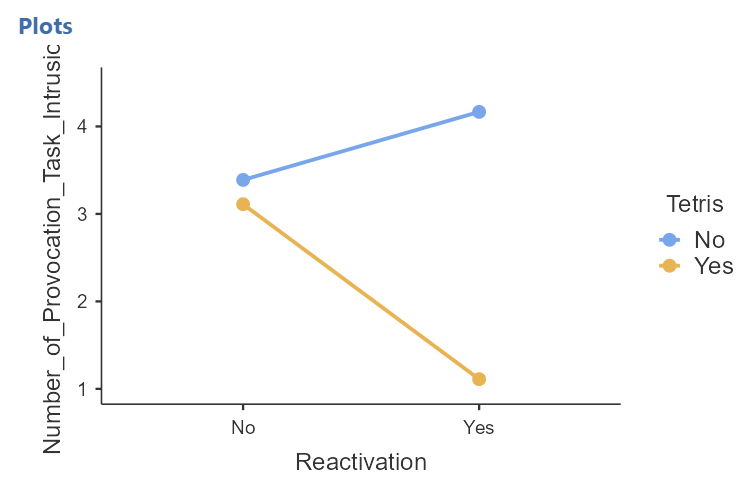

# Factorial ANOVA

<script>
$("#coverpic").hide();
</script>


## That One-Way ANOVA is not a Distant Memory: Rethinking the James et al. (2015) Study

In this lab, we will return to Experiment 2 of the [James et al. (2015)](https://www.erinmazerolle.com/PSYC394Lab/one-way-anova.html#study-description) study. As you will recall, in this experiment, participants provided data in one of four conditions: No-task Control, Reactivation Only, Tetris Only, or Reactivation + Tetris. 


### Study Description

What if, rather than considering the four conditions in the study as being four levels of one independent factor, we broke the factor of condition into two independent variables: Reactivation and Tetris? What if we considered each of those two variables to have two levels (Yes or No)?  

When we shift our thinking of the conditions in this way, we recognize that we can run a factorial ANOVA to analyze this data. 

When we reimagine the study with two variables, we would consider the design of this study to be a 2x2 between-subjects design. There are two independent variables, and they each have two levels. The first IV is Reactivation (Yes or No). The second IV is Tetris (Yes or No). Participants either experienced reactivation in their condition (Yes) or they experienced no reactivation in their condition (No), and participants either played Tetris in their condition (Yes) or they did not play Tetris in their condition (No). 

In a factorial design, each level of one IV (which can also be called a factor) is combined with each level of the other IVs to produce all possible combinations. It can be helpful to see all possible combinations of conditions in a table: 

```{r , echo=FALSE,dev='png'} 
knitr::include_graphics('img/4.Tab.1.png') 
``` 


## Lab Skills Learned

In this lab, we will use JAMOVI to: 

1. Perform a two-way factorial ANOVA 

2. Conduct *post-hoc* follow-up tests (when appropriate)

## Important Stuff

- citation: James, E. L., Bonsall, M. B., Hoppitt, L., Tunbridge, E. M., Geddes, J. R., Milton, A. L., & Holmes, E. A. (2015). Computer game play reduces intrusive memories of experimental trauma via re-consolidation-update mechanisms. Psychological Science, 26, 1201-1215.
- [Link to .pdf of article]('https://www.erinmazerolle.com/PSYC394Lab/pdf/James2015.pdf')

## JAMOVI

<div class="marginnote">
This lab was created by Sherry Neville-MacLean with input from Amara Kohlert and Erin Mazerolle.
</div>

### Checking Assumptions

Recall that the factorial ANOVA is a parametric test, and the factorial ANOVA assumes: 

1. The sampling distributions are normally distributed. Consider the central limit theorem. 

2. The data for the dependent variable are measured using an interval or a ratio scale. Consider what you know about how the data were collected and/or look at the variable attributes in the JAMOVI data spreadsheet.  

3. The scores in different groups are independent. Consider the experimental design and/or look at the JAMOVI data spreadsheet to verify whether or not different participants or subjects contribute to the means. 

4. The variances in the populations are roughly equal (homogeneity of variance). Consider the result of Levene’s test (H0: variances are equal; there is no difference in the variances among the means). 

On your own: Check the data set to see if it meets the first three assumptions listed above. Run the <span style="color:blue">Analyses</span>, <span style="color:blue">Exploration</span>, and <span style="color:blue">Descriptives</span> command. What are your thoughts about whether the assumptions of the factorial ANOVA are met? (The idea is for you to integrate your skills learned in previous labs.) We will review how to check the fourth assumption together. Not unlike the ANOVAs you conducted in previous labs, this ANOVA will involve checking this latter assumption when requesting the analysis in JAMOVI. 


### Performing a Factorial ANOVA & Graphing the Data

To conduct the factorial ANOVA, click <span style="color:blue">Analyses</span>, <span style="color:blue">ANOVA</span>, and <span style="color:blue">ANOVA</span>. Move the dependent variable to the “Dependent Variable” field and the independent variables, or factors, to the “Fixed Factors” field. In our example, we will move `Number_of_Provocation_Task_Intrusions` to the “Dependent Variable” field and both `Reactivation` and `Tetris` to the “Fixed Factors” field.   

```{r , echo=FALSE,dev='png'} 
 
``` 

Under the Assumption Checks ribbon, select “Homogeneity test.”
 
```{r , echo=FALSE,dev='png'} 
knitr::include_graphics('img/4.1b.png') 
``` 

Now, we can check to see if the fourth assumption, the assumption of homogeneity of variance, is upheld or violated. Consider the results of Levene’s test. *Consider this*: What does this result tell us about the assumption of equal variances? 

```{r , echo=FALSE,dev='png'} 
knitr::include_graphics('img/4.2.png') 
``` 

Like any other null hypothesis significance test, we look to the *p*-value and compare it to our set alpha level. Since *p* < .05 (our alpha level), we would fail to reject the null hypothesis. We have no reason to believe there are differences among the variances, i.e. the assumption of homogeneity is upheld. With this met assumption in mind, we would feel comfortable looking at and interpreting the results of an ANOVA without any adjustments. Stated another way, we are comfortable conducting and interpreting Fisher’s ANOVA. 

When interpreting the results of the factorial ANOVA, we typically begin by looking at any possible interaction effects. Interaction effects are more interesting than main effects. When we say there is an interaction, we are saying the effects of one factor are dependent, or contingent, on the level of the other factor. To find interaction effects, we look to the rows where more than one factor is mentioned in a row and there is an asterisk mark between the names of the factors.  

Have a look at the ANOVA results table produced by JAMOVI: 

```{r , echo=FALSE,dev='png'} 
 
``` 

Consider this: Is there a significant interaction between reactivating the memories and playing Tetris? 

At this point, we might formally write something to this effect: 

A 2 x 2 factorial ANOVA revealed that there is significant interaction between reactivation of memories and playing Tetris on number of provocation task intrusions [*F*(1, 68) = 6.34, *p* = .014]. 

Next, we would look at potential main effects. A main effect is the effect of one independent variable or factor on the dependent variable. When we consider main effects, we are combining the levels of the other independent variable. In our example, if we look at a potential main effect of `Tetris` on `Number_of_Provocation_Task_Intrusions`, we would be considering both Reactivation and No Reactivation groups in each level of `Tetris`. See the table below: 

```{r , echo=FALSE,dev='png'} 
knitr::include_graphics('img/4.Tab.2.png') 
``` 

If we look at a potential main effect of `Reactivation` on `Number_of_Provocation_Task_Intrusions`, we would be considering both Tetris and No Tetris groups in each level of `Reactivation`. See the table below: 

```{r , echo=FALSE,dev='png'} 
 
``` 

Have a look at the ANOVA results table produced by JAMOVI: 

```{r , echo=FALSE,dev='png'} 
knitr::include_graphics('img/4.3.maineffects.png') 
``` 

*Consider these questions:* 

What does this table tell us about potential main effects? 

Is there a main effect of `Tetris`?  

Is there a main effect of `Reactivation`?  

In other words, across all conditions did playing Tetris significantly change the number of provocation task intrusions? Did reactivation of memories significantly change the number of provocation task intrusions? 
 
At this point, we might adjust our formal write-up to indicate something to this effect: 

A 2 x 2 factorial ANOVA revealed that, although there is a non-significant main effect of reactivation of memories [*F*(1, 68) = 1.23, *p* > .05], there is a significant main effect of playing Tetris on number of provocation task intrusions [*F* (1, 68) = 9.13, *p* = .004]. Of greater interest, however, there is significant interaction between reactivation of memories and playing Tetris on number of provocation task intrusions [*F* (1, 68) = 6.34, *p* = .014].  

Remember: An interaction simply informs us that the effects of at least one independent variable depend on the level of another independent variable. Whenever an interaction is detected, researchers need to conduct additional analyses to determine where that interaction is coming from. 

At this point, let’s have a look at a graph that can help us visualize what is happening with the means of each of the four groups based on the two independent variables. Recall that you can easily add options to results in the Results panel by clicking on the results of that analysis to highlight them, and then, making changes in the Analysis panel to the left. In the ANOVA analysis commands, you can add a graph. Plots can be considered synonymous with graphs. To get these plots, under the Estimated Marginal Means ribbon, highlight both factors and move them to the “Margin Means” field under Term 1. You will notice that, by default, the Marginal means plots are requested. 

```{r , echo=FALSE,dev='png'} 
knitr::include_graphics('img/4.4.png') 
``` 

Is what you see in the plot, or graph, consistent with your interpretation of the potential interaction from the ANOVA table results in JAMOVI? 

```{r , echo=FALSE,dev='png'} 
 
``` 

Would you be able to describe what’s happening to the number of provocation task intrusions based on this graph? 

Playing Tetris seems to impact number of provocation task intrusions differently depending when reactivation is used. In other words, the effect of playing Tetris on number of provocation task intrusions **depends on** whether or not the participants' memories are reactivated. 

#### Conduct follow-up tests 

##### Planned contrasts 

If we had *a priori* hypotheses about where the difference(s) may be for the main effects, we would conduct planned comparisons. In JAMOVI, these are found pre-programmed contrasts are found under the Contrasts ribbon. *Consider this:* Why would it make no sense for us to conduct planned contrasts on these main effects, even if the effect of `Tetris` is significant? 

Although you need not construct this plot, it might help you consider your answer: 

```{r , echo=FALSE,dev='png'} 
knitr::include_graphics('img/4.6.png') 
``` 

##### *Post-hoc* Tests 

<div class="marginnote">
No turkeys!
</div>

If we had no *a priori* hypotheses about where the difference(s) may be, we would conduct unplanned comparisons, or *post-hoc* tests. To find out where the differences may be among these four means, we will use *post-hoc* tests. We could go through the menus again to request the *post-hoc* tests, or we could simplify the output in the Results pane by clicking on the Results to have the commands pop up to the left. Let’s do the latter. Then, let’s scroll down to the Post Hoc Tests ribbon, move the interaction (`Reactivation * Tetris`) from the list on the left to the window on the right, and then select the correction you want applied. Let’s select Bonferroni and deselect Tukey. 

```{r , echo=FALSE,dev='png'} 
 
``` 

Consider the results of these follow-up tests: 

```{r , echo=FALSE,dev='png'} 
knitr::include_graphics('img/4.8.png') 
``` 

*Question:* Where do the significant interactions occur? 

```{r , echo=FALSE,dev='png'} 
 
``` 

To generate means, we would click on the output table in the results panel to have the analysis window reappear on the left. Then, under the Estimated Marginal Means ribbon and, under Output, we would click to select “Marginal means table.” As we saw with the Repeated-Measures ANOVA, the table that results from that command does not include standard deviations, so we must use the <span style="color:blue">Analyses</span>, <span style="color:blue">Exploration</span>, and <span style="color:blue">Descriptives</span> commands to generate standard deviations. You likely did this before looking at the ANOVA to be sure you met assumptions of the ANOVA. 

Before we consider how to add this information to our APA write-up, let’s look at another set of JAMOVI commands that would allow us to statistically explore the factorial ANOVA> 

#### An Alternative Way to Investigate Main Effects and Interactions: Linear Models 

To conduct the factorial ANOVA, click <span style="color:blue">Analyses</span>, <span style="color:blue">Linear Models</span>, and <span style="color:blue">General Linear Model</span>. Move the dependent variable to the “Dependent Variable” field and the independent variables, or factors, to the “Factors” field. In our example, we will move `Number_of_Provocation_Task_Intrusions` to the “Dependent Variable” field and both `Reactivation` and `Tetris` to the “Factors” field.   

```{r , echo=FALSE,dev='png'} 
 
``` 

You can also request Levene’s test using this set of commands to ensure the data meet the assumption of homogeneity of variance. Simply, click on the Assumption Checks ribbon, and click to select “Homogeneity tests”. 

```{r , echo=FALSE,dev='png'} 
knitr::include_graphics('img/4.10.png') 
``` 

By looking at the Assumption Checks table in the Results panel, you should notice that the results are the same as you saw when you conducted the factorial ANOVA using the <span style="color:blue">ANOVA</span> menu. 

```{r , echo=FALSE,dev='png'} 
 
``` 

The ANOVA results here are in the table entitled “ANOVA Omnibus tests.” 

```{r , echo=FALSE,dev='png'} 
knitr::include_graphics('img/4.12.png') 
``` 

Notice that the results communicated in this table are the same as the results that were communicated when you ran the analysis using the <span style="color:blue">ANOVA</span> menu. 

Seeing that there is a significant interaction, we might be interested in follow-up tests. Again, imagine we were not interested in planned contrasts (since there is no option to select planned contrasts in this menu), but were interested in *post-hoc* tests. Click on the Post Hocs ribbon, move `Reactivation * Tetris` from the list on the left to the window on the right. Notice that, by default in JAMOVI, “Bonferroni” is selected as a correction. 

```{r , echo=FALSE,dev='png'} 
knitr::include_graphics('img/4.13.png') 
``` 

Have a look at resulting Post Hoc Comparisons table in the Results panel: 

```{r , echo=FALSE,dev='png'} 
 
``` 

*Questions:* How does this table compare to the results table you saw with the <span style="color:blue">ANOVA</span> menu? Do you see the same results? 

While using the <span style="color:blue">ANOVA</span> menu had the advantage of allow us to have JAMOVI calculate effect sizes, the <span style="color:blue">Linear Models</span> menu has the advantage of allowing us to probe into those interaction effects in a more comprehensive way. 

We can still request a plot to have a visual inspection. In the the <span style="color:blue">Linear Models</span> menu, click on the Plots ribbon, and move one variable to the Horizontal axis field and the other to the Separate lines field.  

```{r , echo=FALSE,dev='png'} 
knitr::include_graphics('img/4.15.png') 
``` 

Depending on which factor you move to each of those fields, you may see one of the following graphs: 

```{r , echo=FALSE,dev='png'} 
 
``` 

```{r , echo=FALSE,dev='png'} 
 
``` 

You can see that the lines on the second graph intersect. While you cannot see the intersection on the first graph, you can extrapolate from what you see that if the lines were extended, they would intersect. These intersections on the graphs represent interactions. 

Based on this evidence and the statistically significant *p*-value for the interaction that we noticed in the omnibus ANOVA table, we have reason to follow up on the interaction. In the <span style="color:blue">Linear Models</span> menu, there is a Simple Effects ribbon. Click it to get more options. For our example, let’s move `Tetris` to the Simple effects variable field and `Reactivation` to the Moderator field.  

```{r , echo=FALSE,dev='png'} 
knitr::include_graphics('img/4.18.png') 
``` 

In the results panel, look at the new tables: 

```{r , echo=FALSE,dev='png'} 
 
``` 

*Before you keep reading, think about this:* What are these results telling you?   

The *p*-values in the first table, the “Simple effects of Tetris: Omnibus Tests” show that while there is no significant effect of Tetris on number of provocation task intrusions when memories are not reactivated (*p* > .05), there is a significant effect of Tetris on number of provocation task intrusions when memories are reactivated (*p* < .001).  

The results of the second table, the “Simple effects of Tetris: Parameter estimates” show that when there is no reactivation of memories, the contrast between playing Tetris and not playing Tetris is not significant (*p* > .05), and when there is reactivation of memories, the contrast between playing Tetris and not playing Tetris is significant (*p* < .001). Although this table does’t give us much new information (compared to the first table), that would be different if we had more than two levels in one or both of our factors. There would be more than two contrasts to show. 

We can still access the means with the Estimated Marginal Means ribbon. 

```{r , echo=FALSE,dev='png'} 
 
``` 

Let’s look at the marginal means from the interaction. 

```{r , echo=FALSE,dev='png'} 
knitr::include_graphics('img/4.21.png') 
``` 

Again, we still need to use the <span style="color:blue">Analyses</span>, <span style="color:blue">Exploration</span>, and <span style="color:blue">Descriptives</span> commands to have JAMOVI provide the standard deviations. You have this information in your Results panel from earlier when you checked the assumptions for the factorial ANOVA, so we will skip this step for now. That said, you will need the results of that table to write your APA-formatted Results section. As such, return to the table in your Results panel: 

```{r , echo=FALSE,dev='png'} 
 
``` 

### Writing the Results Section  

A 2 x 2 factorial ANOVA revealed that, although there is a non-significant main effect of reactivation of memories [*F*(1, 68) = 1.23, *p* > .05], there is a significant main effect of playing Tetris on number of provocation task intrusions [*F* (1, 68) = 9.13, *p* = .004]. Of greater interest, however, there is significant interaction between reactivation of memories and playing Tetris on number of provocation task intrusions [*F* (1, 68) = 6.34, *p* = .014]. A simple effects analysis indicated that in the absence of reactivating memories, there is no significant effect of playing Tetris on number of provocation task intrusions [*F*(1, 68) = 0.13, *p* > .05]; however, among those participants who were exposed to memory reactivation, there is a significant effect of playing Tetris on number of provocation task intrusions [*F*(1, 68) = 15.35, *p* < .001]. Specifically, for participants who did not undergo memory reactivation, those who played Tetris (*M* = 3.11, *SD* = 2.52, 95% CI [2.01, 4.21]) did not experience a significantly higher number of provocation task intrusions than those who did not play Tetris (*M* = 3.39, *SD* = 2.81, 95% CI [2.29, 4.49]). For participants who did experience memory reactivation, though, those who played Tetris (*M* = 1.11, *SD* = 1.78, 95% CI [0.01, 2.21]) experienced significantly fewer provocation task intrusions than those who did not play Tetris (*M* = 4.17, *SD* = 2.12, 95% CI [3.07, 5.27]). 

For the sake of demonstration only, imagine we did not observe a significant interaction, but wanted to reported on the results of the main effects. We would need to use different means and associated standard deviations. In this case we have only two levels of each variable, so we might use the means and standard deviations from the Descriptives table. We will request two of those tables: one for means and standard deviations split by `Tetris` and one for means and standard deviations split by `Reactivation`. 

```{r , echo=FALSE,dev='png'} 
 
``` 

```{r , echo=FALSE,dev='png'} 
knitr::include_graphics('img/4.25.png') 
``` 

We would report from each of the two tables: 

```{r , echo=FALSE,dev='png'} 
knitr::include_graphics('img/4.24.png') 
``` 

```{r , echo=FALSE,dev='png'} 
knitr::include_graphics('img/4.26.png') 
``` 

We might report something like this: 

Although there is a non-significant main effect of reactivation of memories [*F*(1, 68) = 1.23, *p* > .05], there is a significant main effect of playing Tetris on number of provocation task intrusions [*F* (1, 68) = 9.13, *p* = .004]. Specifically, participants who did not undergo reactivation of memories (*M* = 3.25, *SD* = 2.63) did not experience a significantly different number of provocation task intrusions than those who did undergo reactivation of memories (*M* = 2.64, *SD* = 2.47). Participants who did play Tetris (*M* = 2.11, *SD* = 2.38), though, did experience significantly fewer provocation task intrusions than those who did not play Tetris (*M* = 3.78, *SD* = 2.49). 

### Homework

See [Moodle](https://moodle.stfx.ca).

