# Correlation

```{=html}
<script>
$("#coverpic").hide();
</script>
```

<span class="newthought">
If ... we choose a group of social phenomena with no antecedent knowledge of the causation or absence of causation among them, then the calculation of correlation coefficients, total or partial, will not advance us a step toward evaluating the importance of the causes at work.
-Sir Ronald Fisher
</span>

<div class="marginnote">
Some of this section is copied almost verbatim, with some editorial changes, from [Answering questions with data: The lab manual for R, Excel, SPSS and JAMOVI, Lab 3, Section 3.4, SPSS](https://www.crumplab.com/statisticsLab/lab-3-correlation.html#spss-3), according to its [CC license](https://creativecommons.org/licenses/by-sa/4.0/deed.ast). Thank you to Crump, Krishnan, Volz, & Chavarga (2018). 
</div>

## Lab Skills Learned

In this lab, we will use JAMOVI to calculate the correlation coefficient. We will focus on the most commonly used Pearson's coefficient, *r*. We will learn how to:

1. Calculate the Pearson's *r* correlation coefficient for bivariate data
2. Produce a correlation matrix, reporting Pearson's *r* for more than two variables at a time
3. Produce a scatterplot

## Important Stuff

- citation: Dolan, C. V., Oort, F. J., Stoel, R. D., & Wicherts, J. M. (2009). Testing measurement invariance in the target rotated multigroup exploratory factor model. Structural Equation Modeling, 16(2), 295–314. https://doi.org/10.1080/10705510902751416

- [link to article](https://www.tandfonline.com/doi/full/10.1080/10705510902751416#d1e246) 

## Background and pre-lab tasks

### Assumptions of correlation

This lab will focus on Pearson's correlation. For the calculation to make sense, the data must meet certain criteria. These are known as the assumptions of Pearson's correlation. 

Pearson's correlation assumes:

1. Interval or ratio data (both variables)
2. Related pairs
3. No outliers
4. Linearity of relationship

### Install scatr module if required
As you read through this section on using JAMOVI to conduct correlations, you will see the need for the scatr module. The scatr module may be installed on your version of JAMOVI by default. If so, you should see it loaded under the <span style="color:blue">Analyses</span> ->and  <span style="color:blue">Exploration</span> -> menus:

```{r , echo=FALSE,dev='png'}
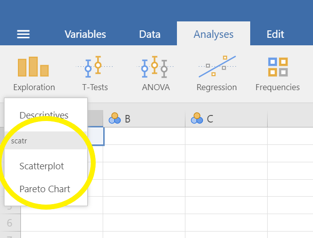
```

If you do not see this module on your version of JAMOVI, before lab, please download and install it using the add-on Modules icon (the plus sign at the top right) and JAMOVI library; due to the short duration of our labs, we will not have time during lab to wait for downloading and installation.

## Conducting the Analyses

### Dataset: The Big Five

For the purpose of the lab demonstration, we will work with a data set provided by Dolan, Oort, Stoel, and Wicherts (2009) in their investigation of measurement invariance. These data were collected from 500 psychology students at University of Amsterdam on the Big Five personality dimensions [Neuroticism (N), Extraversion (E), Openness to experience (O), Agreeableness (A), and Conscientiousness (C)] using the NEO-PI-R test . You can download the data on [Moodle](https://moodle.stfx.ca).

### Correlation Coefficient for Bivariate Data

Bivariate is a fancy way of saying two variables. Let's say you were interested in the relationship between two variables: `Neuroticism` and `Conscientiousness`. To calculate a correlation in JAMOVI, go to <span style="color:blue">Analyses</span> -> <span style="color:blue">Regression</span> -> <span style="color:blue">Correlation Matrix</span>:

```{r , echo=FALSE,dev='png'}
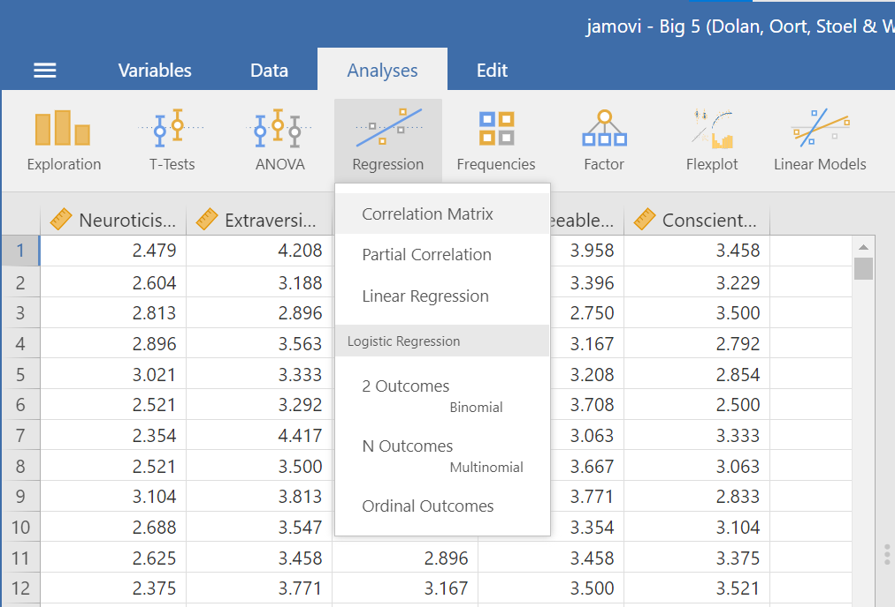
```

<br>

Move your variables of interest, ` Neuroticism ` and `Conscientiousness`, to the window on the right of the commands pane:

```{r , echo=FALSE,dev='png'}
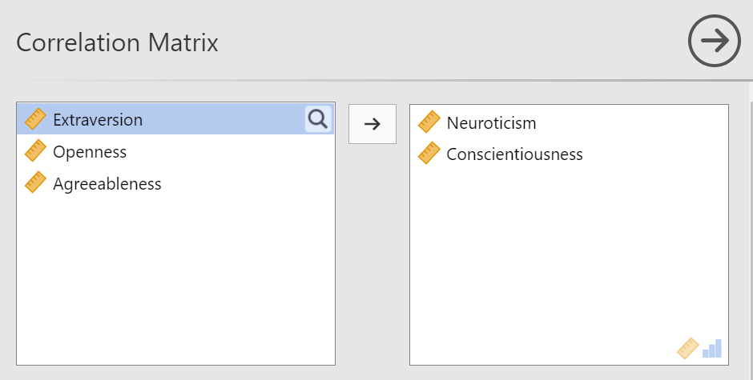
```

<br>

An output table will be generated in the results panel:

```{r , echo=FALSE,dev='png'}
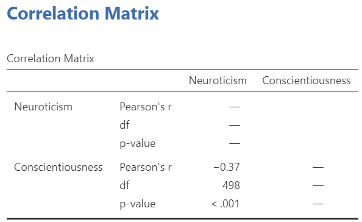
```

<br>

The table indicates that Pearson's *r* between the two variables is -0.37, with a *p*-value of less than .001. This is a negative correlation: as the scores on one variable increase, the scores on the other variable decrease.

Notice the number of other options you might select in the commands pane. You could select <span style="color:blue"> Spearman</span> or <span style="color:blue">Kendall’s tau-b</span> correlations. These tests can be useful if the data are measured on an ordinal scale or if there are outliers. Also, notice the options to request that JAMOVI <span style="color:blue">flag significant correlations</span>  and to request the 95% confidence intervals. By default, the hypothesis is set as <span style="color:blue">Correlated</span> (a two-tailed hypothesis). You might change the default setting by selecting <span style="color:blue">Correlated positively</span> or <span style="color:blue">Correlated negatively</span> (both one-tailed hypotheses). 

```{r , echo=FALSE,dev='png'}
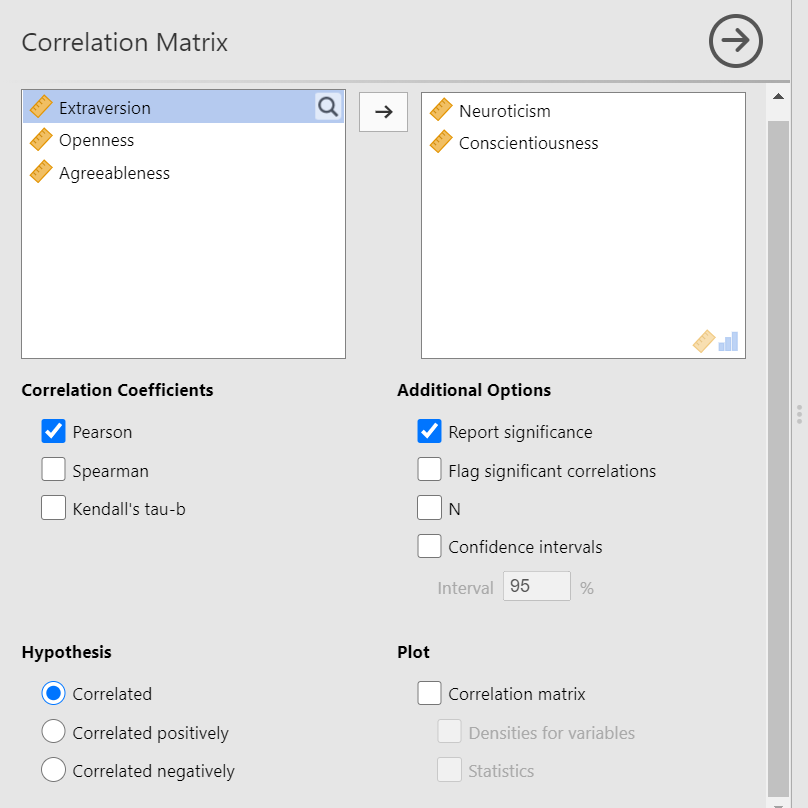
```

Note that if you run a one-tailed test, you will get a different *p*-value than a two-tailed test. Why? Remember: The *p*-value is the probability of getting a test statistic (e.g., Pearson's *r*) as or more extreme than the one you got, assuming the null hypothesis is true. In a two-tailed test, test statistics must be more extreme, compared to a one-tailed test. Imagine a test statistic at the green arrow:

<br>
<div class="marginnote">
Figure modified from https://commons.wikimedia.org/wiki/File:Normalcurvesimple.png according to its Creative Commons Attribution-Share Alike 3.0 Unported license.
</div>

```{r , echo=FALSE,dev='png'}
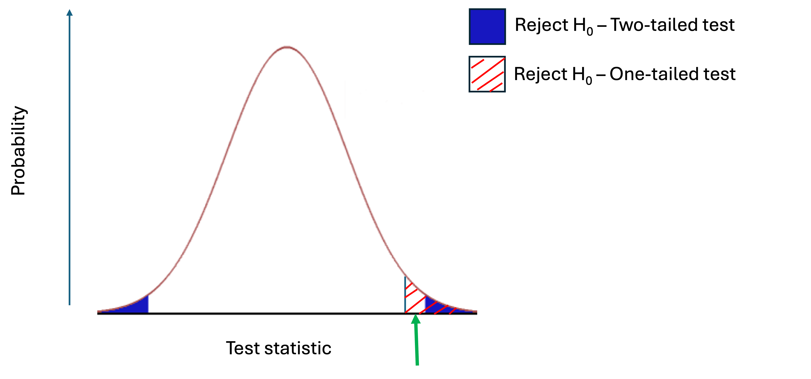
```
<br>


You would reject H~0~ if you ran a one-tailed test, but not a two-tailed test. This is achieved  by doubling the *p*-value for two-tailed tests. 

<br>


### Correlation Matrix

If you have more than two variables in your spreadsheet and would like to evaluate correlations between several variables taken two at a time, you can enter multiple variables into the correlation window and obtain a correlation matrix. The correlation matrix is a table showing every possible bivariate correlation amongst a group of variables.

Let's add all five variables to our correlation matrix. First, move the variable to the right box:

```{r , echo=FALSE,dev='png'}
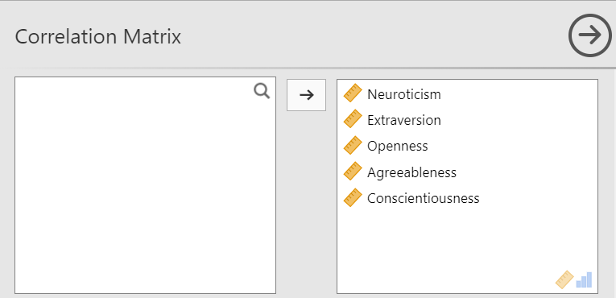
```

<br>

Now the output panel has 10 sets of results:

```{r , echo=FALSE,dev='png'}
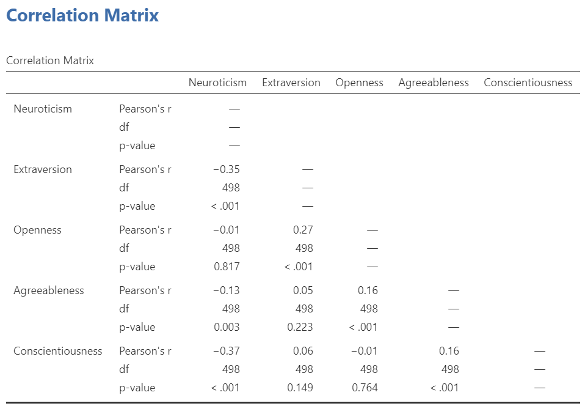
```

<br>

Note that some of the correlations are negative, and some are positive. Some are significant (with *p* < .05), and some are not.

If we request that JAMOVI flag the significant correlations, asterisks (\*) will be used to show the significance levels against three commonly used alpha levels (One asterisk denotes *p* < .05, two asterisks denote *p* < .01, and three asterisks denote *p* < .001.)

```{r , echo=FALSE,dev='png'}
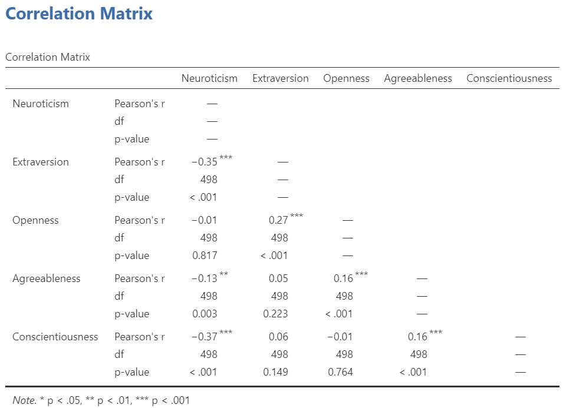
```

<br>


### APA format reporting of a correlation

Recall the output for the correlation between `Neuroticism` and `Conscientiousness`:

```{r , echo=FALSE,dev='png'}

```

<br>

You could write the results in APA format as follows:

>A significant correlation was found between Neuroticism and Conscientiousness, Pearson's *r*(498) = -.37, *p* < .001.

<br>

Note that we did not use a leading zero for *r* and we rounded to two decimal places.

Now consider the example of the correlation between `Neuroticism` and `Openness`:

```{r , echo=FALSE,dev='png'}

```

<br>

To report this result in APA format, you would write something such as:

>There was not a significant correlation between Neuroticism and Openness, Pearson's *r*(498) = -.01, *p* > .05.

**Some formatting guidelines for writing results sections:**

a. Indicate the name of the test you performed (in this case, Pearson's correlation) and whether the result is significant or non-significant (*Note: We do not use the word insignificant.*). 

b. We usually round to two decimal places, except for *p*-values. If your *p*-value was .0001, it would be okay to write *p* = .0001 or *p* < .001.

c. Do not include a leading 0 before the decimal for the *p*-value (*p* = .001 not *p* = 0.001, or *p* < .05 not *p* < 0.05) or for correlation coefficients, *r* (for example, *r*(df) = .56).

<div class="marginnote">
Yes, I'm serious. No, I don't know why. Yes, it does seem a bit silly. Yes, you lose points if you don't adhere to APA format when requested to do so.
</div>

d. Pay attention to spaces, parentheses, etc. APA is very picky about that. For example, it's *t*(33.4) = -3.48 **not** *t*(33.4)=-3.48. There are spaces on either side of =, >, or < symbols.

e. Italicize symbols such as *M*, *SD*, *p*, and *r*.


### Correlation and Scatterplots

To accompany the calculation of the correlation coefficient, the scatterplot is the relevant graph. Depending on your version of JAMOVI, you may have the option to enable a correlation matrix plot from the correlation matrix commands panel. Let’s return to the first correlational analysis with only two variables, `Neuroticism` and `Conscientiousness`. Highlight those results in your Results pane, and click to add <span style="color:blue">Correlation matrix </span>  under the “Plot.”

```{r , echo=FALSE,dev='png'}
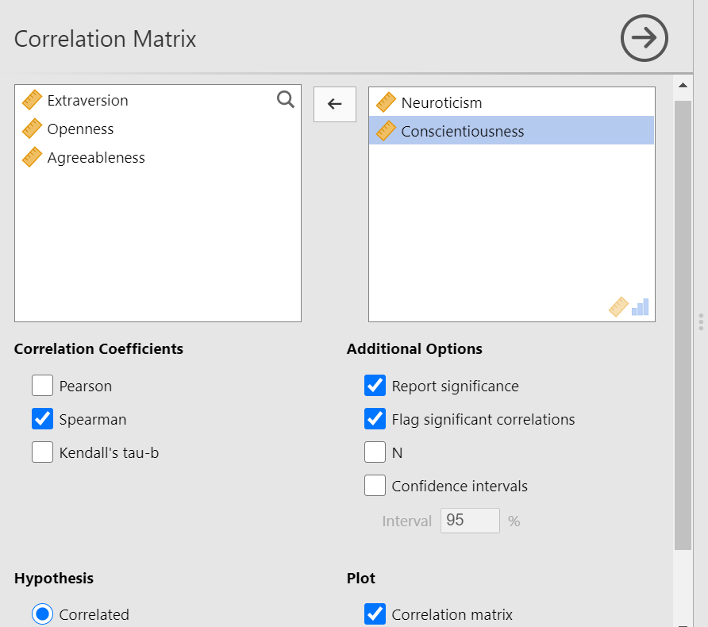
```

<br>


This will produce a scatterplot for the correlations.
```{r , echo=FALSE,dev='png'}
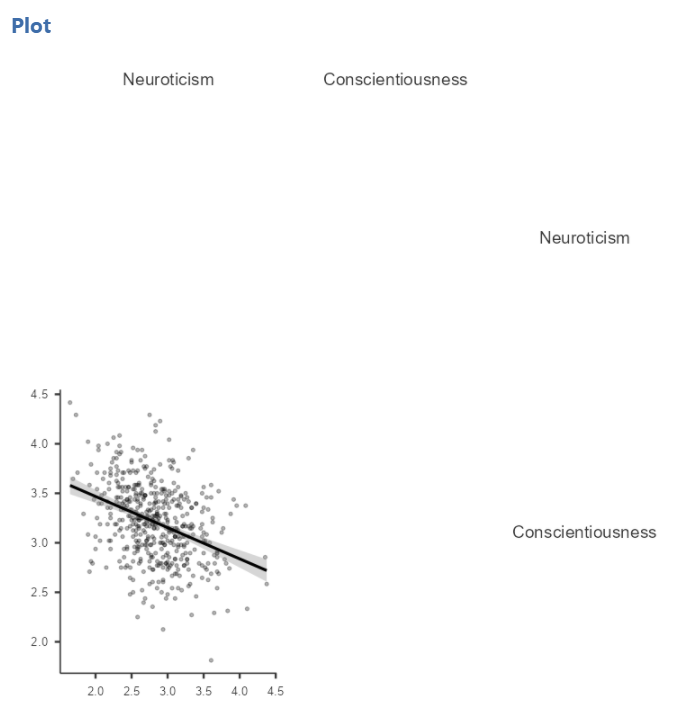
```

<br>


These plots are handy for having a quick look, but are relatively small. Furthermore, when there are a number of correlations requested, the labels or axes values may start to overlap resulting in a graph that is not easy to read. Consider this result generated when the plot is requested in the correlational analysis involving all five variables:

This will produce a scatterplot for the correlations.
```{r , echo=FALSE,dev='png'}
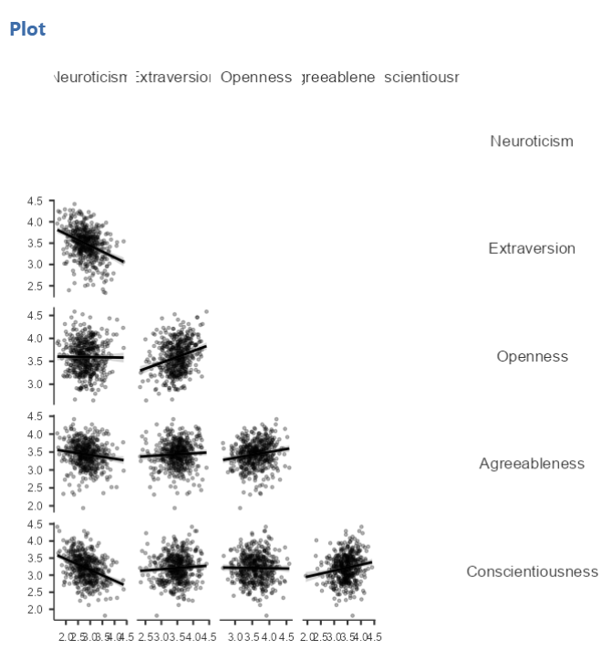
```

<br>


#### Getting a visual of the correlation

Let's continue to create the scatterplot for this data, starting with the `Neuroticism` and `Conscientiousness` variables.

Go to <span style="color:blue">Analyses</span>, then <span style="color:blue">Exploration</span>, and then <span style="color:blue">Scatterplot</span>.

```{r , echo=FALSE,dev='png'}
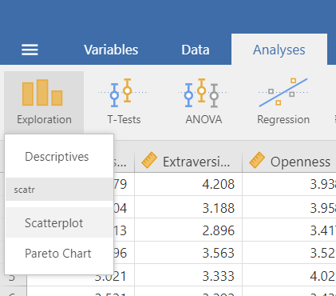
```

<br>


Move `Neuroticism` into the X-Axis box and `Conscientiousness` into the Y-Axis box.
 
```{r , echo=FALSE,dev='png'}
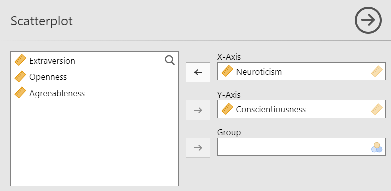
```

<br>


In the Results panel, JAMOVI will produce a scatterplot of your data, as follows:

```{r , echo=FALSE,dev='png'}
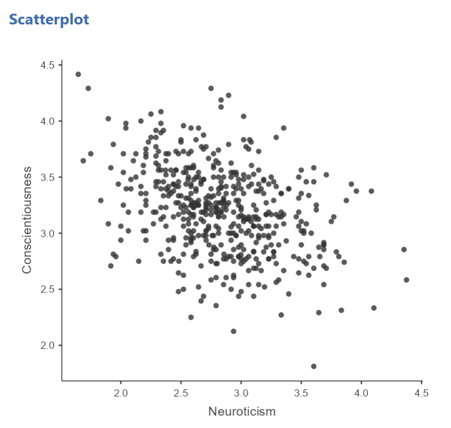
```

<br>


At this point, it would be equally correct to plot `Conscientiousness` on the *x*-axis and `Neuroticism` on the *y*-axis. Note that you get a different graph:

```{r , echo=FALSE,dev='png'}
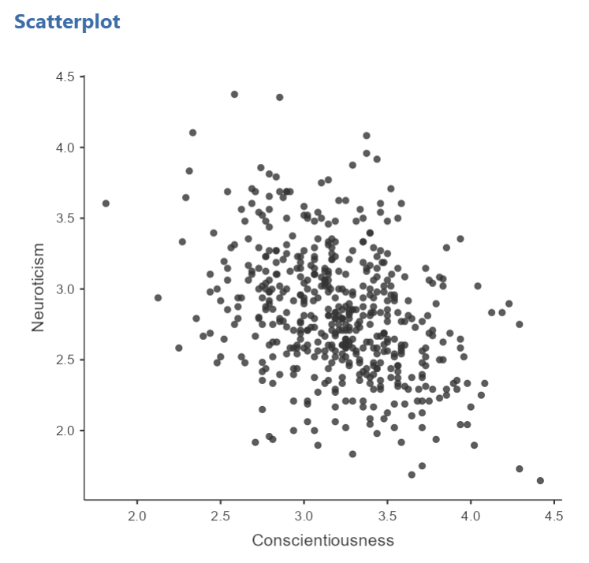
```

<br>


Let's continue with the second scatterplot, with `Conscientiousness ` on the *x*-axis and `Neuroticism` on the *y*-axis. You might keep this graph as it is, or you may choose to include a line through it. To add the line, select <span style="color:blue">Linear</span> under Regression Line. This line is known as the best fit line (or the line of best fit) because it minimizes the distance between the line and the data points.

```{r , echo=FALSE,dev='png'}
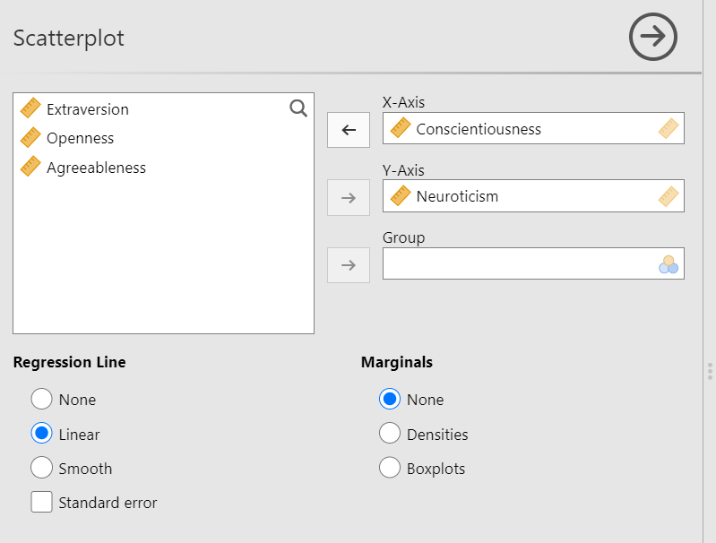
```

<br>

You will find that the graph in your Results panel has now updated and has a line drawn on it.

```{r , echo=FALSE,dev='png'}

```

<br>

This best fit line goes from the upper top left to the bottom right; it has a negative slope. This is consistent with the negative Pearson's *r* we found in the correlation matrix. 

### Optional activities

Consider a from Schroeder and Epley (2015) (available on [Moodle](https://moodle.stfx.ca)).
Rather than asking about a difference in how candidates were perceived by recruiters as the authors did, imagine you had a different research question: Is the age of the candidate correlated with intellect ratings? You could answer this using correlation. Click <span style="color:blue">Analyses</span>, <span style="color:blue">Regression</span>, and <span style="color:blue">Correlation Matrix</span>.

```{r , echo=FALSE,dev='png'}
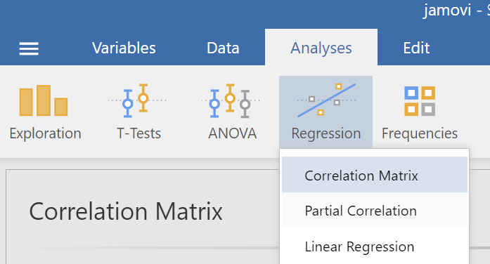
```

<br>

Then, move `age` and `intellect` into the untitled box at the right of the pop-up screen:

```{r , echo=FALSE,dev='png'}
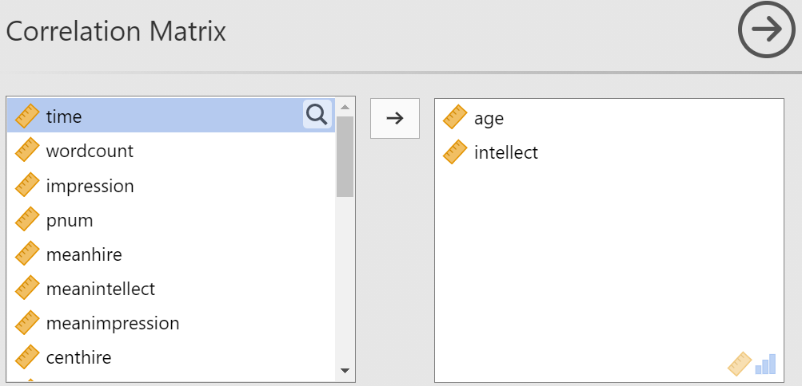
```

<br>

In the Results panel, the output table should look as follows:

```{r , echo=FALSE,dev='png'}
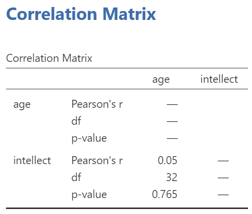
```

<br>

Write a sentence describing the results of this test. Compare your answer to #1 in the "Example answers to practice problems" below. 

Now, assume you are in the mood to do some exploratory data analysis. We can run multiple bivariate correlations at the same time in the same dialog. Click <span style="color:blue">Analyses</span>, then <span style="color:blue">Regression</span>, and then <span style="color:blue">Correlation Matrix</span> again. To the untitled variables box at the right, add `age`, `time`, `wordcount`, `intellect`,  and `impression`:

```{r , echo=FALSE,dev='png'}
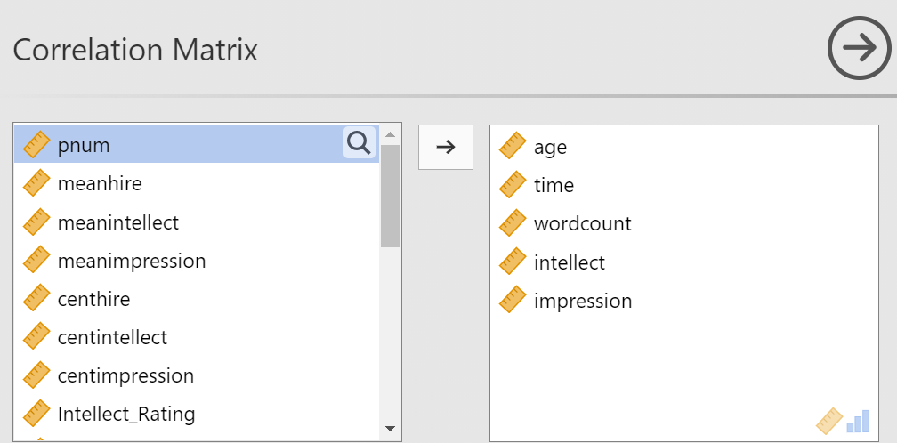
```

<br>

In the Results panel, the output table contains the *r*- and *p*-values for each possible pair of the five variables:

```{r , echo=FALSE,dev='png'}
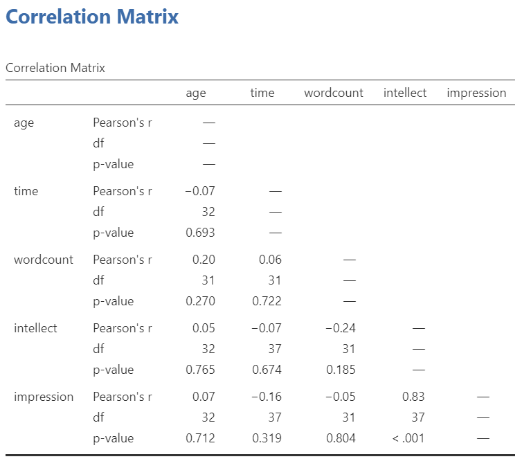
```

<br>

By default, JAMOVI does not flag significant correlations. Be sure to review the *p*-values careful and compare them to the alpha level you set.  How many significant correlations do you identify in the correlation matrix?

If you would like JAMOVI to flag significant correlations, you can click <span style="color:blue">Flag significant correlations</span> under “Additional options”. 

```{r , echo=FALSE,dev='png'}
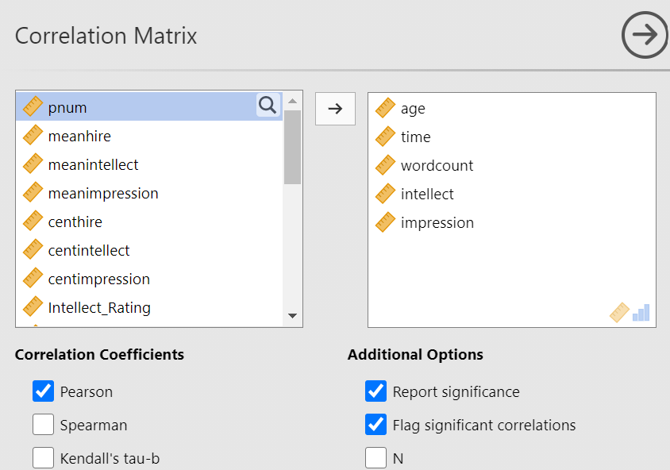
```

<br>

As aforementioned, under the correlation matrix that appears in the Results panel, you will notice a note. If the *p*-value is under .05, JAMOVI will flag the correlation coefficient as * (significant at the .05 level); if the *p*-value is less than .01, JAMOVI will flag it as ** (significant at the .01 level); and if the *p*-value is less than .001, JAMOVI will flag it as *** (significant at the .001 level).

```{r , echo=FALSE,dev='png'}
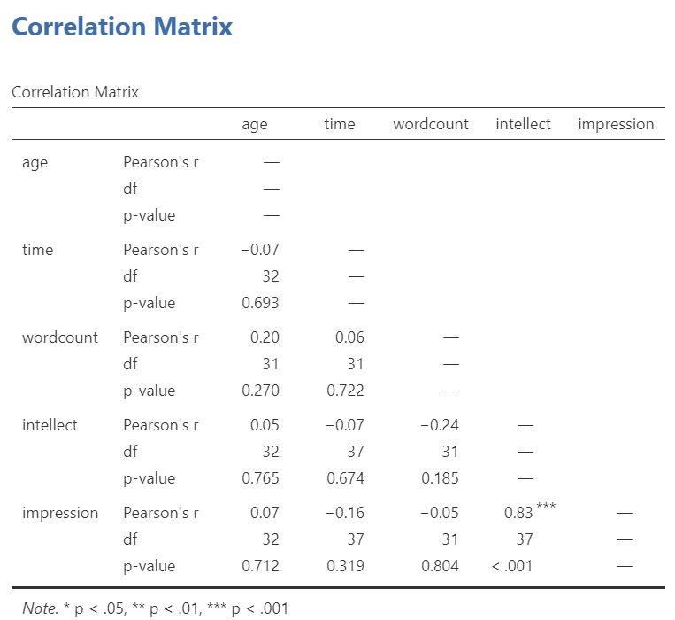
```

<br>

Let's pick a few pairs of variables and make scatterplots. We have a good range of different correlations in this table, so we can use these data to practice identifying correlations of different strengths. Click <span style="color:blue">Analyses</span>, <span style="color:blue">Exploration</span>, and then <span style="color:blue">Scatterplot...</span>. Move `intellect` into the Y-Axis field and `age` into the X-Axis field. 

```{r , echo=FALSE,dev='png'}
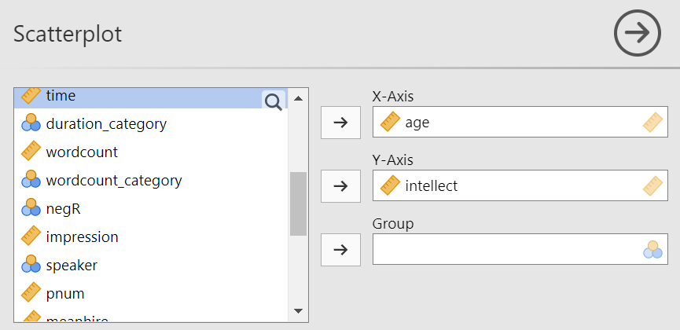
```

<br>

These commands should produce a scatterplot in the Results panel. 

```{r , echo=FALSE,dev='png'}
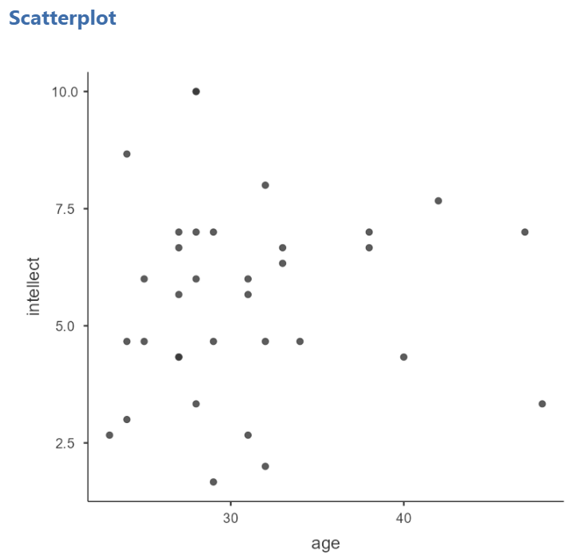
```

<br>

Repeat for all correlations with `intellect`, using `intellect` on the *y*-axis each time to make it easier to compare to the example answers below (#2). Compare the pattern of dots in each scatterplot to the *r*-values reported in the tables. Can you see the differences between the plots? Can you tell from the scatterplots whether we have violated any of the assumptions of Pearson's *r* (i.e., linearity, no outliers)?

### Example answers to optional activities

1. Intellect ratings were not significantly correlated with the age of the candidates, Pearson's *r*(32) = .05, *p* > .05.

2. You should have created four scatterplots. They are included below as well as some notes about each. 

```{r , echo=FALSE,dev='png'}

```
For the correlation between `age` and `intellect`, we found Pearson's *r* was very close to 0, at .05. This is reflected in the pattern of dots, which are spread fairly uniformly across the entire plot. There are no concerns with violating the assumption of linearity on this plot. There are also no outliers.

```{r , echo=FALSE,dev='png'}
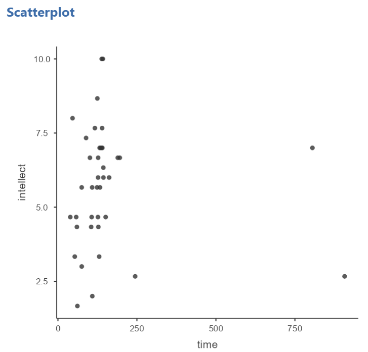
```
For the correlation between `time` and `intellect`, we found Pearson's *r* was also close to 0 but negative, at -.07. It is harder to link the *r* with the plot in this case because of the two dots far to the right in the plot. These might be outliers and could be investigated further. (Challenge yourself: Can you identify those cases that create the two dots off to the left? Are they outliers? How do you know? How would you deal with them if they are outliers? Why?) 

```{r , echo=FALSE,dev='png'}
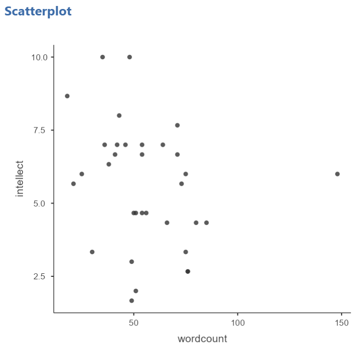
```
The correlation between `wordcount` and `intellect` was Pearson's *r* = -.24. This is a fairly weak correlation. The dot to the far right in the first plot might be an outlier and could be investigated further. (Challenge yourself: Can you identify those cases that create the two dots off to the left? Are they outliers? How do you know? How would you deal with them if they are outliers? Why?) If you focus on the cluster of dots on the left, you can get the impression that there are more dots in the top left and bottom right than the other two quadrants. 

Next, let's look at the scatterplot for `impression` and `intellect`.

```{r , echo=FALSE,dev='png'}
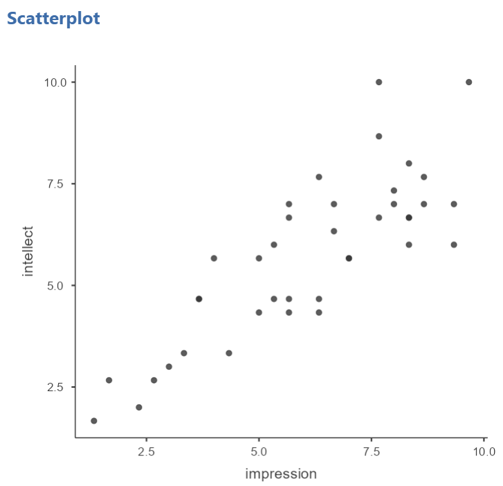
```
For `impression` and `intellect`, a correlation of Pearson's *r* = .83 was observed. In the scatterplot, you can see the dots cluster around an imaginary line that goes from the bottom left corner to the top left corner. There are no concerns that the assumption of linearity has been violated. There is also no evidence of outliers.


## Homework

See [Moodle](https://moodle.stfx.ca).


## Practice Problems

<div class="marginnote">
Questions 2-4 are copied  verbatim from [Answering questions with data: The lab manual for R, Excel, SPSS and JAMOVI, Lab 3, Section 3.2.4, SPSS](https://www.crumplab.com/statisticsLab/lab-3-correlation.html#writing-assignment-2), according to its [CC license](https://creativecommons.org/licenses/by-sa/4.0/deed.ast). Thank you to Crump, Krishnan, Volz, & Chavarga (2018). 
</div>

1. Check the data set used in the lab demonstration to see if it meets the assumptions of Pearson’s correlation. If not, indicate how you might “clean” the data. Justify your answer.

2. Imagine a researcher found a positive correlation between two variables, and reported that the *r* value was +.3. One possibility is that there is a true correlation between these two variables. Discuss one alternative possibility that would also explain the observation of +.3 value between the variables.

3. Explain the difference between a correlation of *r* = .3 and *r* = .7. What does a larger value of *r* represent?

4. Explain the difference between a correlation of *r* = .5, and *r* = -.5.
