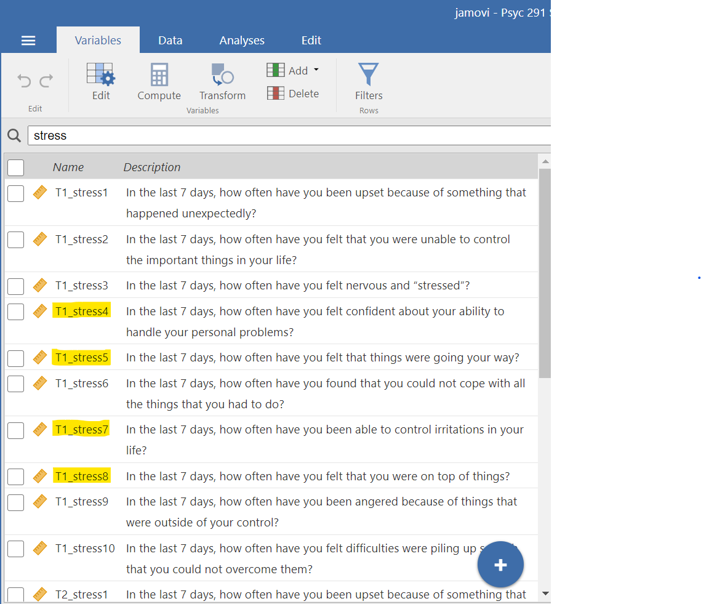
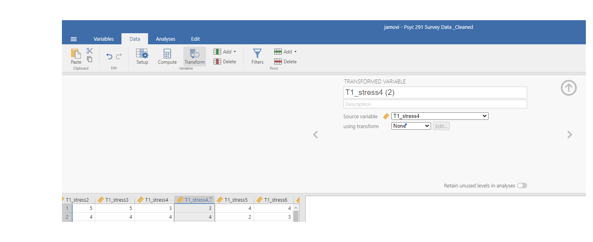
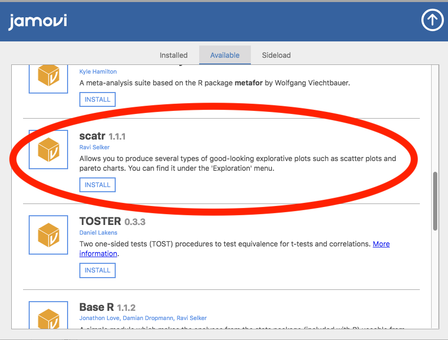

--- 
title: "Answering questions with data: Lab Manual"
author: 
- "Matthew J. C. Crump, Anjali Krishnan, Stephen Volz, and Alla Chavarga"
- "Adapted for PSYC 394, St. Francis Xavier University, by Erin L. Mazerolle and Sherry Neville-MacLean"
date: "Last Compiled `r Sys.Date()`"
site: bookdown::bookdown_site
output: 
  bookdown::gitbook:
    includes:
      in_header: includeme.html
      before_body: testpic.html
    css: [tufte.css, style.css]
    fontsettings:
      theme: white
      family: sans
      size: 1
documentclass: book
bibliography: [book.bib, packages.bib, MyLibrary.bib]
biblio-style: apalike
link-citations: yes
#github-repo: rstudio/bookdown-demo
description: "A lab manual for Psyc 394 at StFX"
---

```{r setup, include=FALSE}
knitr::opts_chunk$set(message=FALSE,warning=FALSE, cache=TRUE)
```


# Preface {-}

```{r,eval=FALSE,echo=F,fig.align="center"}
knitr::include_graphics("LabmanualCover.png")
```

This is the companion lab to our free introductory statistics for undergraduates in psychology textbook, [Answering questions with data](https://www.erinmazerolle.com/statistics/).

This lab manual involves step by-step tutorials to solve data analysis problems in software. We use open-data sets that are usually paired with a primary research article.

The manual is a free and open resource. See below for more information about copying, making change, or contributing to the lab manual.

## Important notes

This lab manual is released under a creative commons licence [CC BY-SA 4.0](https://creativecommons.org/licenses/by-sa/4.0/). Click the link to read more about the license, or read more below in the license section.

This lab manual is part of a larger OER course package for teaching undergraduate statistics in Psychology. Team members include, Matthew Crump, Alla Chavarga, Anjali Krishnan, Jeffrey Suzuki, and Stephen Volz. As this OER comes together, we will be providing a [course website](https://crumplab.github.io/psyc3400/), written in R Markdown, as well as slide decks for the lectures (these will be more fully available by the end of fall 2018). As a result, this textbook, the lab manual, the course website, and the slide decks will all be free, under a creative commons license. The source code for all material is contained in the GitHub repositories for each, and they are a written in R-markdown, so they are relatively easy to copy and edit. Have Fun!

### Attributions and Versions

**First Draft (version 0.9 = August 15th, 2018)**

This was the version we used to adapt the lab manual. That project can be found [here](https://crumplab.github.io/statisticsLab/). It was authored by Matt Crump (R exercises), Anjali Krishnan (JAMOVI exercises), Stephen Volz (EXCEL exercises), and Alla Chavarga (SPSS exercises). Labs 6, 7, and 8 were adapted and expanded from [Open Stats Labs](https://sites.trinity.edu/osl). Thanks to Open Stats Labs (Dr. Kevin P. McIntyre) for their fantastic work.

**Version 1.0 = April, 2021**

This version was our first edit of the lab manual for PSYC 292 at StFX (Winter 2021), and was completed by Erin Mazerolle and Sherry Neville-MacLean. The changes were mainly focused on the SPSS sections of Labs 1, 2, 3, 6, and 7, and in particular, the homework questions. We also added Lab 12.

**Version 2.0 = April, 2024** 

We updated the lab manual to include JAMOVI activities that will use in PSYC 292 at StFX.

Section 0.6 of Lab 0 was adapted nearly verbatim, with some editorial changes, from Chapter 3, "Getting started with jamovi," from Navarro, D.J., & Foxcroft, D.R. (2019). Learning statistics with jamovi: A tutorial for psychology students and other beginners. (Version 0.70) while adhering to its license that states "The book is released under a Creative Commons CC BY-SA 4.0 licence. This means that this book can be reused, remixed, retained, revised and redistributed (including commercially) as long as appropriate credit is given to the authors. If you remix, or modify the original version of this open textbook, you must redistribute all versions of this open textbook under the same license - [CC BY-SA](https://creativecommons.org/licenses/by-sa/4.0/deed.ast). DOI: 10.24384/hgc3-7p15

**In progress: Version 3.0.** Last Compiled: `r Sys.Date()`

We have split this lab manual from the previous version which incorporated activities for both PSYC 292 and PSYC 394. This version focuses on PSYC 394 only.

We have created a new activity for Factorial ANOVA.

### CC BY-SA 4.0 license

This license means that you are free to:

- Share: copy and redistribute the material in any medium or format
- Adapt: remix, transform, and build upon the material for any purpose, even commercially.

The licensor cannot revoke these freedoms as long as you follow the license terms.

Under the following terms:

- Attribution: You must give appropriate credit, provide a link to the license, and indicate if changes were made. You may do so in any reasonable manner, but not in any way that suggests the licensor endorses you or your use.
- ShareAlike: If you remix, transform, or build upon the material, you must distribute your contributions under the same license as the original.
- No additional restrictions: You may not apply legal terms or technological measures that legally restrict others from doing anything the license permits.

### Copying the lab manual

This lab manual was written in R-Studio, using R Markdown, and compiled into a web-book format using the bookdown package. 

All of the source code for this book is available in a GitHub repository: [https://github.com/erinmaz/statisticsLab](https://github.com/erinmaz/statisticsLab)

In addition, the source code for the project this book was based on can be found at: [https://github.com/CrumpLab/statisticsLab](https://github.com/CrumpLab/statisticsLab)

In principle, anybody could fork or otherwise download this repository. Load the Rproj file in R-studio, and then compile the entire book. Then, the individual .rmd files for each chapter could be edited for content and style to better suit your needs.

If you want to contribute to this version of the lab manual, you could make pull requests on GitHub, or discuss issues and request on the issues tab.


### Acknowledgments

Thanks to the librarians at Brooklyn College of CUNY, especially Miriam Deutch, and Emily Fairey, for their support throughout the process. Thanks to CUNY for supporting OER development, and for the grant we received to develop this work.

Development of version 2.0 (described above) was funded by the [Council of Atlantic University Libraries](https://www.caul-cbua.ca/) through an AtlanticOER Development Grant awarded to Erin Mazerolle, Christine Lomore, Margaret Vail, Derrick Lee, Sherry Neville-MacLean, and Lindsay Berrigan. 


## Data

Data files used for the labs are all taken from open data sources. Links are provided for each lab. For convenience, all of the data files are also available here as single files in the github repository for this lab manual

### Data Repository

[https://github.com/CrumpLab/statisticsLab/tree/master/data](https://github.com/CrumpLab/statisticsLab/tree/master/data)

### CSV format

All of the data files in .csv format are also available to [download as a .zip file](https://raw.githubusercontent.com/CrumpLab/statisticsLab/master/data/data_csv.zip)

### SPSS format

All of the data files in SPSS format are also available to [download as a .zip file](https://raw.githubusercontent.com/CrumpLab/statisticsLab/master/data/spssdata/spss_data.zip)


## Software: JAMOVI 

In our lab sessions, we will be using jamovi to help us with the analyses about which we are learning in classes. Throughout each lab, we will show you how to use jamovi to solve specific problems, and then you will use the examples to solve in-lab assignments, homework, and the analysis for your team project.

### Getting Started with jamovi

<div class="marginnote">
This section, including its associated figures, is copied almost verbatim, with some minor editorial changes, from [Learning statistics with jamovi: A tutorial for psychology students and other beginners, Version 0.70](https://www.learnstatswithjamovi.com/), according to its [CC license](https://creativecommons.org/licenses/by-sa/4.0/deed.ast). Thank you to Navarro & Foxcroft (2019). 
</div>

In this section, I'll discuss how to get started in jamovi. I'll briefly talk about how to download and install jamovi, but most of the chapter will be focused on getting you started with finding your way around the jamovi GUI. Our goal in this chapter is not to learn any statistical concepts: we're just trying to learn the basics of how jamovi works and get comfortable interacting with the system. To do this, we'll spend a bit of time looking at datasets and variables. In doing so, you'll get a bit of a feel for what it's like to work in jamovi. 

However, before going into any of the specifics, it's worth talking a little about why you might want to use jamovi at all. Given that you're reading this, you've probably got your own reasons. However, if those reasons are *because that's what my stats class uses*, it might worth explaining a little why your lecturer has chosen to use jamovi for the class. Of course, I don't really know why *other* people choose jamovi, so I'm really talking about why I use it.

- It's sort of obvious but worth saying anyway: doing your statistics on a computer is faster, easier and more powerful than doing statistics by hand. Computers excel at mindless repetitive tasks, and a lot of statistical calculations are both mindless and repetitive. For most people, the only reason to ever do statistical calculations with pencil and paper is for learning purposes. In my class, I do occasionally suggest doing some calculations that way, but the only real value to it is pedagogical. It does help you to get a "feel" for statistics to do some calculations yourself, so it's worth doing it once. But only once!

- Doing statistics in a conventional spreadsheet (e.g., Microsoft Excel) is generally a bad idea in the long run. Although many people likely feel more familiar with them, spreadsheets are very limited in terms of what analyses they allow you do. If you get into the habit of trying to do your real life data analysis using spreadsheets, then you've dug yourself into a very deep hole.

- Avoiding proprietary software is a very good idea. There are a lot of commercial packages out there that you can buy, some of which I like and some of which I don't. They're usually very glossy in their appearance and generally very powerful (much more powerful than spreadsheets). However, they're also very expensive. Usually, the company sells "student versions" (crippled versions of the real thing) very cheaply, and then they sell full-powered "educational versions" at a price that makes me wince. They will also sell commercial licenses with a staggeringly high price tag. The business model here is to suck you in during your student days and then leave you dependent on their tools when you go out into the real world. It's hard to blame them for trying, but personally I'm not in favour of shelling out thousands of dollars if I can avoid it, and you can avoid it. If you make use of packages like jamovi that are open source and free, you never get trapped having to pay exorbitant licensing fees. 

- Something that you might not appreciate now, but will love later on if you do anything involving data analysis, is the fact that jamovi is basically a sophisticated front end for the free R statistical programming language. When you download and install R you get all the basic "packages" and those are very powerful on their own. However, because R is so open and so widely used, it's become something of a standard tool in statistics and so lots of people write their own packages that extend the system. And these are freely available too. One of the consequences of this, I've noticed, is that if you look at recent advanced data analysis textbooks then a *lot* of them use R. 

<br>
Those are the main reasons I use jamovi. It's not without its flaws, though. It's relatively new^1^[As of writing this in August 2018.] so there is not a huge set of textbooks and other resources to support it, and it has a few annoying quirks that we're all pretty much stuck with, but on the whole I think the strengths outweigh the weakness; more so than any other option I've encountered so far. <br>

#### Installing jamovi
<br>
Okay, enough with the sales pitch. Let's get started. Just as with any piece of software, jamovi needs to be installed on a *computer*, which is a magical box that does cool things and delivers free ponies. Or something along those lines; I may be confusing computers with the iPad marketing campaigns. Anyway, jamovi is freely distributed online and you can download it from the jamovi homepage, which is:


[jamovi Homepage](https://www.jamovi.org/)


<div class="marginnote">
As previously indicated, the content of this section comes from [Learning statistics with jamovi: A tutorial for psychology students and other beginners, Version 0.70](https://www.learnstatswithjamovi.com/), according to its [CC license](https://creativecommons.org/licenses/by-sa/4.0/deed.ast). 
</div>

At the top of the page, under the heading "Download," you'll see separate links for Windows users, Mac users, and Linux users. If you follow the relevant link, you'll see that the online instructions are pretty self-explanatory. As of this writing, the current solid version of jamovi is 2.3.28, but they usually issue updates every few months, so you'll probably have a newer version.^2^[Athough jamovi is updated frequently, it doesn't usually make much of a difference for the sort of work we'll do in this book. In fact, during the writing of the book, I upgraded several times, and it didn't make much difference at all to what is in this book.]


#### Starting jamovi up

One way or another, regardless of what operating system you're using, it's time to open jamovi and get started. When first starting jamovi, you will be presented with a user interface which looks something like [the figure below].

<div class="marginnote">
As previously noted in this section, this figure is copied from [Learning statistics with jamovi: A tutorial for psychology students and other beginners, Version 0.70](https://www.learnstatswithjamovi.com/), according to its [CC license](https://creativecommons.org/licenses/by-sa/4.0/deed.ast). Thank you to Navarro & Foxcroft (2019). 
</div>

```{r , echo=FALSE,dev='png'}
knitr::include_graphics('img/startingjamovi.png')
```

To the left is the spreadsheet view, and to the right is where the results of statistical tests appear. Down the middle is a bar separating these two regions, and this bar can be dragged to the left or the right to change the sizes of the two view. 

It is possible to simply begin typing values into the jamovi spreadsheet as you would in any other spreadsheet software. Alternatively, existing data sets in the CSV (.csv) file format can be opened in jamovi. Additionally, you can easily import SPSS, SAS, Stata and JASP files directly into jamovi. To open a file, select the File tab (three horizontal lines signify this tab) at the top left hand corner, select `Open` and then choose from the files listed on "Browse" depending on whether you want to open an example or a file stored on your computer.

### Analyses 

Analyses can be selected from the analysis ribbon or menu along the top. Selecting an analysis will present an `Options` panel for that particular analysis, allowing you to assign different variables to different parts of the analysis and to select different options. At the same time, the results for the analysis will appear in the right `Results` panel and will update in real-time as you make changes to the options.

When you have the analysis set up correctly, you can dismiss the analysis options by clicking the arrow to the top right of the optional panel. If you wish to return to these options, you can click on the results that were produced. In this way, you can return to any analysis that you (or say, a colleague) created earlier.

If you decide you no longer need a particular analysis, you can remove it with the results context menu. Right-clicking on the analysis results will bring up a menu, and by selecting `Analysis` and then `Remove`, the analysis can be removed. But more on this later. First, let's take a more detailed look at the spreadsheet view.

### The Spreadsheet

In jamovi, data is represented in a spreadsheet with each column representing a ***variable*** and each row representing a ***case*** or ***participant***.

#### Variables

The most commonly used variables in jamovi are **Data Variables**, these variables simply contain data either loaded from a data file, or *typed in* by the user. Data variables can be one of three measurement levels:

<div class="marginnote">
As previously noted in this section, this figure is copied from [Learning statistics with jamovi: A tutorial for psychology students and other beginners, Version 0.70](https://www.learnstatswithjamovi.com/), according to its [CC license](https://creativecommons.org/licenses/by-sa/4.0/deed.ast). Thank you to Navarro & Foxcroft (2019). 
</div>

```{r , echo=FALSE, dev='png'}
knitr::include_graphics('img/measurementlevels.png')
```

These levels are designated by the symbol in the header of the variable's column.

The ***ID*** variable type is unique to jamovi. It's intended for variables that contain identifiers that you would almost never want to analyze, for example, a person’s name or a participant ID. Specifying an ID variable type can improve performance when interacting with very large data sets.

***Nominal*** variables are for categorical variables which are text labels, for example, a column called Gender with the values Male and Female would be nominal. So would a person's name. Nominal variable values can also have a numeric value. These variables are used most often when importing data which codes values with numbers rather than text. For example, a column in a dataset may contain the values 1 for males and 2 for females. It is possible to add nice, *human-readable* labels to these values with the variable editor (more on this later).

***Ordinal*** variables are like Nominal variables, except the values have a specific order. An example is a Likert scale with 3 being *strongly agree* and -3 being *strongly disagree*.

***Continuous*** variables are variables which exist on a continuous scale. Examples might be height or weight. Continuous scales are also referred to as **Interval** or **Ratio** scale.

In addition, you can also specify different data types: variables have a data type of either *Text*, *Integer*, or *Decimal*. 

When starting with a blank spreadsheet and typing values in, the variable type will change automatically depending on the data you enter. This is a good way to get a feel for which variable types go with which sorts of data. Similarly, when opening a data file, jamovi will try to guess the variable type from the data in each column. In both cases, this automatic approach may not be correct, and it may be necessary to manually specify the variable type with the variable editor.

The variable editor can be opened by selecting `Setup` from the data tab or by double-clicking on the variable column header. The variable editor allows you to change the name of the variable and, for data variables, the variable type, the order of the levels, and the label displayed for each level. Changes can be applied by clicking the `tick` to the top right. The variable editor can be dismissed by clicking the `Hide` arrow.

New variables can be inserted or appended to the data set using the `Add` button from the data ribbon. The `Add` button also allows the addition of computed variables.

#### Computed Variables

Computed Variables are those which take their value by performing a computation on other variables. Computed Variables can be used for a range of purposes, including log transforms, *z*-scores, sum-scores, negative scoring, and means.

One way computed variables can be added to the data set with the <span style="color:blue">Add</span> button available on the <span style="color:blue">Data</span> tab. This will produce a drop-down menu in which you select where you want the variable to be placed. If you select <span style="color:blue">Insert</span> under the heading "Computed Variable," the new computed variable appears to the left of the currently highlighted variable. If you select <span style="color:blue">Append</span>, the variable goes to the far right of all variables currently included (think "Appendix"). Alternatively, under the <span style="color:blue">Data</span> menu tab, you could select <span style="color:blue">Compute</span>. This command will lead to the newly computed variable appearing to the right of your currently highlighted variable. After making your selection, a formula box where you can specify the formula will appear. The usual arithmetic operators are available. Some examples of formulas are:

A + B 

LOG10(len)

MEAN(A, B)

(dose - VMEAN(dose)) / VSTDEV(dose)

In order, these are the sum of A and B, a log (base 10) transform of len, the mean of A and B, and the *z*-score of the variable dose. The figure below shows the jamovi screen for the new variable computed as the *z*-score of dose (from the `Tooth Growth' example data set).

<div class="marginnote">
As previously noted in this section, this figure is copied from [Learning statistics with jamovi: A tutorial for psychology students and other beginners, Version 0.70](https://www.learnstatswithjamovi.com/), according to its [CC license](https://creativecommons.org/licenses/by-sa/4.0/deed.ast). Thank you to Navarro & Foxcroft (2019). 
</div>


```{r , echo=FALSE, out.width="75%", dev='png'}
knitr::include_graphics('img/computedvariable.png')
```
\caption{A newly computed variable, the z-score of `dose'.}


*V-functions*.  
Several functions are already available in jamovi and available from the drop down box labelled *f~x~*. A number of functions appear in pairs, one prefixed with a V and the other not. V functions perform their calculation on a variable as a whole whereas non-V functions perform their calculation row by row. For example, MEAN(A, B) will produce the mean of A and B for each row whereas VMEAN(A) gives the mean of all the values in A.

##### Rationale for Recoding

<div class="marginnote">

This section and its subsection was developed by Sherry Neville-MacLean. This content is added to what was presented by Navarro & Foxcroft (2019) for the purposes of a lab lesson.

</div>

As you may recall from classes about research methods, one problem researchers using surveys face is response bias on the part of their participants. There are different kinds of response bias. For our purposes, consider participants who tire of answering survey questions and decide to select all extreme responses. These data are not useful. 

As one way to catch extreme responses, the researcher can word some of survey questions in the opposite way. Imagine an example where the researcher is using a scale on which “extremely agree” indicates participants score high on the construct being measured (ex. gratitude). Consider this survey statement: “On most days, I feel I have things in my life for which I am grateful.” A response of “extremely agree” indicates gratitude. The researcher may reword some statements in the questionnaire so that “extremely agree” indicates the participants score low on the construct. After rewording, another statement on the gratitude questionnaire might read like this: “I wish I were as fortunate as other people in my life who often come by success and/or material things more easily than I do.” A response of “extremely agree” indicates lack of gratitude. 

To be able to look at individual survey respondents' score across all questions, their overall score on the gratitude scale, the researcher often, first, must recode some "negatively" worded items' scores. In the above example, the second answer would need to be recoded before being considered with the answer to the first item, the "positively" worded statement.

###### An Example of Recoding and Computing a New Variable

<div class="marginnote">

The following demonstration of how to recode data and compute a new variable is done using the example of the Perceived Stress Scale. This measurement tool is from Cohen, S., & Williamson, G. (1988). Psychological stress in a probability sample of the United States. In S. Spacapan & S. Oskamp (Eds.), *The social psychology of health: Claremont Symposium on Applied Social Psychology* (pp. 31–67). Newbury Park, CA: Sage. **This material is being used educational purposes. Please be sure to follow copyright laws if you plan to reuse this material.**

</div>

Let’s consider a scale that is often used as a measure of stress in psychological studies, the Perceived Stress Scale, by Cohen and Williamson (1988). We can walk through the process of recoding data and data computations with this example. Let’s begin by looking at the scale itself.

**Perceived Stress Scale**

*Instructions*: The questions in this scale ask you about your feelings and thoughts during the last month. In each case, you will be asked to indicate how often you felt or thought a certain way. Although some of the questions are similar, there are differences between them and you should treat each one as a separate question. The best approach is to answer each question fairly quickly. That is, don’t try to count up the number of times you felt a particular way, but rather indicate the alternative that seems like a reasonable estimate. 

For each question, chose from the following alternatives:

0 = never

1 = almost never

2 = sometimes

3 = fairly often

4 = very often


*Questions*: In the last month, how often have you…

1. been upset because of something that happened unexpectedly?

2. felt that you were unable to control the important things in your life?

3. felt nervous and “stressed”?

4. felt confident about your ability to handle your personal problems?

5. felt that things were going your way?

6. found that you could not cope with all the things that you had to do?

7. been able to control irritations in your life?

8. felt that you were on top of things?

9. been angered because of things that happened that were outside of your control?

10. felt difficulties were piling up so high that you could not overcome them?


Those questions that are negatively worded in terms of the construct will be reverse coded before moving forward to a calculation. 

Indicate the numbers of the items that appear to be worded in terms that scoring a 4 (very often) would represent showing stress (the construct). (*Notice: This question is not asking you if the construct of stress is positive or negative. It is asking if answering the question with a 4 would indicate a high level of the construct.*) Write your answers on a sheet or in a document.

Indicate the numbers of the items that appear to be worded in terms that scoring a 4 (very often) would represent showing lack of stress (the construct). (*Notice: This question is not asking you if the construct is positive or negative. It is asking if answering the question with a 4 would indicate lack of the construct.*) Write your answers on the same sheet or in the same document.

Check your answers: 
If you answered that scoring a 4 on questions 1, 2, 3, 6, 9, and 10 would indicate stress, you are correct.
If you answered that scoring a 4 on questions 4, 5, 7, and 8 would indicate lack of stress, you are correct!

Notice that the "Stress" scale in the PSYC 291 Survey data dictionary is adapted from the PSS. In the PSYC 291 Survey, respondents were asked about these items, but for the past week, not the past month. The levels of the response options were the same as the PSS. For some reason, however, the data in the data set range from 1 to 5. It seems reasonable that 1 represents "never" and 5 represents "very often," and we will proceed using this idea of the scale anchors.

```{r , echo=FALSE,dev='png'}
knitr::include_graphics('img/StressScaleFromPSYC291Survey.png')
```

Let’s work through the process of computing a new variable (a composite variable) using the Stress items for T1 in the PSYC 291 Survey data file. As you can see in the data dictionary, T1 is "during the first week of classes in September." The first step to computing the new variable is recoding. We need to recode items 4, 5, 7, and 8 before we can compute a composite score for all Stress items. 

```{r , echo=FALSE,dev='png'}

```

We will begin by recoding item 4, shown as `T1_stress4` in the data file. While the column for that item is highlighted, select <span style="color:blue">Data</span>, and then, select <span style="color:blue">Transform</span>.

```{r , echo=FALSE,dev='png'}
knitr::include_graphics('img/StressScale_CommandsToRecode.png')
```

A new column will appear to the right of the column for the `T1_stress4` and the variable attributes panel will drop down. (As you can imagine, you could also use these commands: <span style="color:blue">Data</span>, <span style="color:blue">Add</span>, and under "Transformed Variable," either <span style="color:blue">Insert</span> or <span style="color:blue">Append</span>.) You can fill in the information for what you want this variable to be called and record its notable attributes. For our purposes, let’s call it `T1_stress4_Recoded`. You can see that the source variable is correctly shown as `T1_stress4`. 

```{r , echo=FALSE,dev='png'}

```

```{r , echo=FALSE,dev='png'}
knitr::include_graphics('img/StressScale_RenamingT1Stress4RecodedVariable.png')
```

Now, it is time to add the transform rule that you want used. Click on the white box after “using transform” and select <span style="color:blue">Create New Transform</span>. 

```{r , echo=FALSE,dev='png'}
knitr::include_graphics('img/StressScale_TransformationToRecodeT1Stress4.png')
```

When you do click that button, a new panel will appear. 

```{r , echo=FALSE,dev='png'}
knitr::include_graphics('img/StressScale_TransformationToRecodeT1Stress4_2.png')
```

Let’s fill in the information to tell JAMOVI what we want done to the data. We will give the transformation a name (“Reverse_Coding”) and click the <span style="color:blue">Show formula editor</span> button which looks like *f~x~*. 

```{r , echo=FALSE,dev='png'}
knitr::include_graphics('img/StressScale_TransformationToRecodeT1Stress4_3.png')
```

A new panel opens, and we will enter the formula to have the transformations calculated. 

```{r , echo=FALSE,dev='png'}
knitr::include_graphics('img/StressScale_TransformationToRecodeT1Stress4_4.png')
```

Because 5 is the maximum score value and 1 is the minimum score value, we can write this equation to get the recoded values:

```{r , echo=FALSE,dev='png'}
knitr::include_graphics('img/StressScale_TransformationToRecodeT1Stress4_5.png')
```

Go ahead and check the math on each of those recoded values!

To close the transformation panel, click on the downward facing arrow.

```{r , echo=FALSE,dev='png'}
knitr::include_graphics('img/StressScale_TransformationToRecodeT1Stress4_6.png')
```

To get out of  the Transformed Variable panel, click on the upward facing arrow.

```{r , echo=FALSE,dev='png'}
knitr::include_graphics('img/StressScale_TransformationToRecodeT1Stress4_7.png')
```

You should see the recoded T1_stress4 value in the `T1_stress4_Recoded` column.

Repeat the steps to recode `T1_stress5`, `T1_stress7`, and `T1_stress8`. For these cases, you will not need to select <span style="color:blue">Create New Transform</span>. Instead, you will select the transformation rule you already created, <span style="color:blue">Reverse_Coding </span>.

```{r , echo=FALSE,dev='png'}
knitr::include_graphics('img/StressScale_TransformationToRecodeT1Stress4_8.png')
```

Now, you can see all 4 recoded values. Notice the transformed variables are noted with red circles by their names at the top of the columns.

```{r , echo=FALSE,dev='png'}
knitr::include_graphics('img/StressScale_TransformationToRecodeT1Stress4_9.png')
```

Recall the scoring instructions say that after recoding the values for these scale items, we should sum the scores. Let’s do that now. 
Move to the column for `T1_stress10`, highlight that column, and select <span style="color:blue">Data</span> and select <span style="color:blue">Compute</span>.

```{r , echo=FALSE,dev='png'}
knitr::include_graphics('img/StressScale_ComputationCommands.png')
```

If the Computed Variable panel does not drop down for you, click on <span style="color:blue">Setup</span> while the column for the new variable is highlighted. 

```{r , echo=FALSE,dev='png'}
knitr::include_graphics('img/StressScale_ComputationCommands_2.png')
```

Let’s fill in the variable attributes and enter the formula for JAMOVI to follow to compute the sum. Remember, we want to include the recoded values for items 4, 5, 7, and 8. We do not want to include the original values for those items. One way to calculate the sum is by using the SUM command in the formula editor and placing all variable names you want included in the sum in the brackets behind the word SUM with commas between the variable names. Alternatively, you could select each variable name and use plus signs between them.

```{r , echo=FALSE,dev='png'}
knitr::include_graphics('img/StressScale_ComputationFormula1.png')
```

```{r , echo=FALSE,dev='png'}
knitr::include_graphics('img/StressScale_ComputationFormula2.png')
```

As you did with the Transformed Variable panel, you can close the Computed Variable panel by clicking the upward facing arrow.
This may seem like a lot of work to do for a score on one variable; however, you can imagine these commands and having JAMOVI do this recoding and computation work is a mega timesaver when you are working with a large data set or recoding and/or computations of many variables.

#####  Z-scores (as a Type of Computed Variable in JAMOVI)

<div class="marginnote">

This section was developed by Sherry Neville-MacLean. This content is added to what was presented by Navarro & Foxcroft (2019) for the purposes of a lab lesson.

</div>

There will be times when you want to compute *z*-scores. (For example, you may want to look at a large data set and decide whether you have extreme outliers.) Getting *z*-scores in JAMOVI is very easy. 

Let’s look at the process to get the *z*-scores for those `Stress Composite Score` values. 

```{r , echo=FALSE,dev='png'}
knitr::include_graphics('img/StressScale_Column.png')
```

In JAMOVI, *z*-scores can be obtained by selecting <span style="color:blue">Data</span> and <span style="color:blue">Compute</span> after the variable column is highlighted. As before, you can click on <span style="color:blue">Setup</span> while the column for the new variable is highlighted to fill in the Computed Variable attributes. When entering those attributes, you should also enter the formula for the *z*-score. The Z is found in the formula editor’s drop-down menu, but it can also be typed in. The variable name is in that drop-down menu, too. Similarly, it can be type instead.

```{r , echo=FALSE,dev='png'}
knitr::include_graphics('img/StressScale_ZScoreFormula.png')
```

Remember to click the upward facing arrow to close the Computed Variable panel. `Standardized Stress Score` in the image below depicts the *z*-scores for `Stress Composite Score`. Notice that computed variables have a black circle to the right of their name near the top of the column.

```{r , echo=FALSE,dev='png'}
knitr::include_graphics('img/StressScale_ZScoreColumn.png')
```

##### Copy and Paste

jamovi produces nice American Psychological Association (APA) formatted tables and attractive plots. It is often useful to be able to copy and paste these, perhaps into a Word document, or into an email to a colleague. To copy results, right click on the object of interest, and from the menu, select exactly what you want to copy. The menu allows you to choose to copy only the image or the entire analysis. Selecting `copy` copies the content to the clipboard, and this content can be pasted into other programs in the usual way. You can practice this later on when we do some analyses.

##### Syntax Mode

jamovi also provides an "R Syntax Mode". In this mode, jamovi produces equivalent R code for each analysis. To change to syntax mode, select the Application menu to the top right of jamovi (a button with three vertical dots) and click the "Syntax mode" checkbox there. You can turn off syntax mode by clicking this a second time.

In syntax mode, analyses continue to operate as before, but now they produce R syntax and *ascii output* like an R session. Like all results objects in jamovi, you can right click on these items (including the R syntax) and copy and paste them, for example into an R session. At present, the provided R syntax does not include the data import step and so this must be performed manually in R. There are many resources explaining how to import data into R and if you are interested we recommend you take a look at these; just search on the interweb. 

### Loading Data in jamovi

There are several different types of files that are likely to be relevant to us when doing data analysis. There are two in particular that are especially important from the perspective of this book:

- ***jamovi files*** are those with an .omv file extension. This is the standard kind of file that jamovi uses to store data, variables, and analyses. 

- ***Comma separated value (.csv) files*** are those with a .csv file extension. These are just regular old text files and they can be opened with many different software programs. It's quite typical for people to store data in .csv files, precisely because they're so simple.


There are also several other kinds of data file that you might want to import into jamovi. For instance, you might want to open Microsoft Excel spreadsheets (.xls files), or data files that have been saved in the native file formats for other statistics software, such as SPSS or SAS.  Whichever file formats you are using, it's a good idea to create a folder or folders especially for your jamovi data sets and analyses and to make sure you keep these backed up regularly. 

#### Importing Data from CSV Files

One quite commonly used data format is the humble *comma separated value* file, also called a .csv file, and usually bearing the file extension .csv. [These] .csv files are just plain old-fashioned text files, and what they store is basically just a table of data. This is illustrated in [the figure below], which shows a file called \filename{booksales.csv} that I've created. As you can see, each row represents the book sales data for one month. The first row doesn't contain actual data though; it has the names of the variables.

<div class="marginnote">
As previously noted in this section, this figure is copied from [Learning statistics with jamovi: A tutorial for psychology students and other beginners, Version 0.70](https://www.learnstatswithjamovi.com/), according to its [CC license](https://creativecommons.org/licenses/by-sa/4.0/deed.ast). Thank you to Navarro & Foxcroft (2019). 
</div>

```{r , echo=FALSE, out.width="75%", dev='png'}
knitr::include_graphics('img/booksalescsv.png')
```
\caption{The \filename{booksales.csv} data file. On the left, I've opened the file using a spreadsheet program (OpenOffice), which shows that the file is basically a table. On the right, the same file is open in a standard text editor (the TextEdit program on a Mac), which shows how the file is formatted. The entries in the table are wrapped in quote marks and separated by commas.}

It's easy to open .csv files in jamovi. From the top left menu (the button with three parallel lines), choose `Open` and browse to where you have stored the csv file on your computer. If you're on a Mac, it'll look like the usual Finder window that you use to choose a file; on Windows, it looks like an Explorer window. An example of what it looks like on a Mac is shown in [the following figure]. I'm assuming that you're familiar with your own computer, so you should have no problem finding the .csv file that you want to import! Find the one you want, and then click on the "Open" button. 

<div class="marginnote">
As previously noted in this section, this figure is copied from [Learning statistics with jamovi: A tutorial for psychology students and other beginners, Version 0.70](https://www.learnstatswithjamovi.com/), according to its [CC license](https://creativecommons.org/licenses/by-sa/4.0/deed.ast). Thank you to Navarro & Foxcroft (2019). 
</div>

```{r , echo=FALSE, out.width="75%", dev='png'}
knitr::include_graphics('img/openscreen.png')
```
\caption{A dialog box on a Mac asking you to select the .csv file jamovi should try to import. Mac users will recognize this immediately; it's the usual way in which a Mac asks you to find a file. Windows users won't see this; instead, they'll see the usual Explorer window that Windows always gives you when it wants you to select a file.}
 

There are a few things that you can check to make sure that the data gets imported correctly: 

- Heading. Does the first row of the file contain the names for each variable - a `header` row? The {booksales.csv} file has a header, so that's a yes.

- Separator. What character is used to separate different entries? In most .csv files, this will be a comma (it is "comma separated" after all).

- Decimal. What character is used to specify the decimal point? In English-speaking countries, this is almost always a period (i.e., {.}). That's not universally true though. Many European countries use a comma. 

- Quote. What character is used to denote a block of text? That's usually going to be a double quote mark ({"}). It is for the {booksales.csv} file.


### Importing Unusual Data Files

Throughout this book, I've assumed that your data are stored as a jamovi {.omv} file or as a "properly" formatted .csv file. However, in real life, that's not a terribly plausible assumption to make so I'd better talk about some of the other possibilities that you might run into. 

#### Loading Data from Text Files

The first thing I should point out is that if your data are saved as a text file but aren't *quite* in the proper .csv format, then there's still a pretty good chance that jamovi will be able to open it. You just need to try it and see if it works. Sometimes, though, you will need to change some of the formatting. The ones that I've often found myself needing to change are:

- *header*. A lot of the time when you're storing data as a .csv file, the first row actually contains the column names and not data. If that's not true, then it's a good idea to open up the .csv file in a spreadsheet programme such as Open Office and add the header row manually. 

- *sep*. As the name "comma separated value" indicates, the values in a row of a .csv file are usually separated by commas. This isn't universal, however. In Europe, the decimal point is typically written as {,} instead of {.}, and as a consequence, it would be somewhat awkward to use {,} as the separator. Therefore, it is not unusual to use {;} instead of {,} as the separator. At other times, I've seen a TAB character used. 

- *quote*. It's conventional in .csv files to include a quoting character for textual data. As you can see by looking at the {booksales.csv} file, this is usually a double quote character, {"}. But sometimes there is no quoting character at all, or you might see a single quote mark (') used instead. 

- *skip*. It's actually very common to receive .csv files in which the first few rows have nothing to do with the actual data. Instead, they provide a human readable summary of where the data came from, or maybe they include some technical info that doesn't relate to the data. 

- *missing values*. Often, you'll be given data with missing values. For one reason or another, some entries in the table are missing. The data file needs to include a "special" value to indicate that the entry is missing. By default, jamovi assumes that this value is {99}^3^[You can change the default value for missing values in jamovi from the top right menu (three vertical dots), but this only works at the time of importing data files into jamovi. The default missing value in the dataset should not be a valid number associated with any of the variables, e.g. you could use {-9999} as this is unlikely to be a valid value.], for both numeric and text data, so you should make sure that, where necessary, all missing values in the .csv file are replaced with {99} (or {-9999}; whichever you choose) before opening / importing the file into jamovi. Once you have opened / imported the file into jamovi, all the missing values are converted to blank cells in the jamovi spreadsheet view.


##### Loading Data from SPSS (and other statistics packages)

The commands listed above are the main ones we'll need for data files in this book. But, in real life, we have many more possibilities. For example, you might want to read data files from other statistics programs. Since SPSS is probably the most widely used statistics package in psychology, it's worth mentioning that jamovi can also import SPSS data files (.sav file extension). Just follow the instructions above for how to open a .csv file, but this time navigate to the .sav file you want to import. For SPSS files, jamovi will regard all values as missing if they are regarded as "system missing" files in SPSS. The `Default missing` value does not seem to work as expected when importing SPSS files, so be aware of this - you might need another step: import the SPSS file into jamovi, and then export as a .csv file before re-opening in jamovi.^4^[I know this is a bot of a fudge, but it does work, and hopefully this will be fixed in a later version of jamovi.].

And that's pretty much it, at least as far as SPSS goes.  As far as other statistical software goes, jamovi can also directly open / import SAS and STATA files. 

##### Loading Excel Files 

A different problem is posed by Excel files. Despite years of yelling at people for sending data to me encoded in a proprietary data format, I get sent a lot of Excel files. The way to handle Excel files is to open them up first in Excel or another spreadsheet programme that can handle Excel files, and then export the data as a .csv file before opening / importing the csv file into jamovi. 

### Changing Data from One Level to Another

Sometimes you want to change the variable level. This can happen for all sorts of reasons. Sometimes when you import data from files, it can come to you in the wrong format. Numbers sometimes get imported as nominal, text values. Dates may get imported as text. Participant ID values can sometimes be read as continuous. Nominal values can sometimes be read as ordinal or even continuous. There's a good chance that sometimes you'll want to convert a variable from one measurement level into another one. Or, to use the correct term, you want to *coerce* the variable from one class into another. 

In Section 0.6.3, we saw how to specify different variable levels, and if you want to change a variable's measurement level, then you can do this in the jamovi data view for that variable. Just click the check box for the measurement level you want - continuous, ordinal, or nominal. 


### Installing Add-on Modules into jamovi 

A really great feature of jamovi is the ability to install add-on modules from the jamovi library. These add-on modules have been developed by the jamovi community, i.e., jamovi users and developers who have created special software add-ons that do other, usually more advanced, analyses that go beyond the capabilities of the base jamovi program. 

To install add-on modules, just click on the large \large{"+"} in the top right of the jamovi window, select `jamovi-library` and then browse through the various add-on modules that are available. Choose the one(s) you want, and then install them, as in [the following figure]. It's that easy. The newly installed modules can then be accessed from the `Analyses` button bar. Try it...useful add-on modules to install include `scatr` (added under `Descriptives`) and `\R\ j`. 

<div class="marginnote">
As previously noted in this section, this figure is copied from [Learning statistics with jamovi: A tutorial for psychology students and other beginners, Version 0.70](https://www.learnstatswithjamovi.com/), according to its [CC license](https://creativecommons.org/licenses/by-sa/4.0/deed.ast). Thank you to Navarro & Foxcroft (2019). 
</div>

```{r , echo=FALSE, out.width="75%", dev='png'}

``` 
\caption{Installing add-on modules in jamovi}


### Quitting jamovi 

There's one last thing I should cover in this chapter: how to quit jamovi. It's not hard, just close the program the same way you would any other program. However, what you might want to do before you quit is save your work! There are two parts to this: saving any changes to the data set, and saving the analyses that you ran.

It is good practice to save any changes to the data set as a *new* data set. That way you can always go back to the original data. To save any changes in jamovi, select `Export...Data` from the main jamovi menu (button with three horizontal bars in the top left) and create a new file name for the changed data set.

Alternatively, you can save *both* the changed data and any analyses you have undertaken by saving as a jamovi file. To do this, from the main jamovi menu select `Save as` and type in a file name for this `jamovi file (.omv)`. Remember to save the file in a location where you can find it again later. I usually create a new folder for specific data sets and analyses.  


### Summary

Every book that tries to teach a new statistical software program to novices has to cover roughly the same topics, and in roughly the same order. Ours is no exception, and so in the grand tradition of doing it just the same way everyone else did it, this chapter covered the following topics:

- In Section 0.6.1, we downloaded and installed jamovi, and started it up.
- In Section 0.6.2, we very briefly oriented to the part of jamovi where analyses are done and results appear, but then deferred this until later in the book.
- In Section 0.6.3, we spent more time looking at the spreadsheet part of jamovi, and considered different variable types, and how to compute new variables.
- In Section 0.6.4, we also saw how to load data files in jamovi.
- Then, in Section 0.6.5, we figured out how to open other data files, from different file types.
- In Section 0.6.6, we saw that sometimes we need to coerce data from one type to another.
- According to Section 0.6.7, installing add-on modules from the jamovi community really extends jamovi capabilities.
- Finally, in Section 0.6.8, we looked at good practice in terms of saving your data set and analyses when you have finished and are about to quit jamovi.


\noindent
We still haven't arrived at anything that resembles data analysis. Maybe the next Chapter will get us a bit closer!

